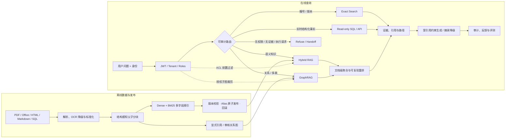

<div align="center">

# Enterprise RAG Lab

### ACL-first Hybrid RAG · GraphRAG · SAG Memory

把“能检索”推进到**可授权、可解释、可评测、可回滚**的企业知识系统实验基座。

[](https://github.com/StagoMax/enterprise-rag-p1/actions/workflows/ci.yml)
[](https://www.python.org/)
[](https://fastapi.tiangolo.com/)
[](https://milvus.io/)
[](LICENSE)
[](#项目状态)

[快速开始](#快速开始) · [系统架构](#系统架构) · [能力矩阵](#能力矩阵) · [评测证据](#评测证据) · [完整文档](#完整文档) · [参与贡献](CONTRIBUTING.md)

</div>

> [!IMPORTANT]
> 这是公开、可复现的研究预览，不是已完成真实企业试点的生产产品。当前 Graph、权限、工具与拒答专项已形成稳定证据；28,481 文档规模下的普通语义检索仍未达到项目发布门槛。

## 为什么是这个项目

企业 RAG 的难点不只是向量相似度。一个可审查的系统必须同时回答：**谁能看到、问题该走哪条链路、证据从哪里来、索引如何发布、指标是否真的可比**。

Enterprise RAG Lab 把这些约束放进同一套工程闭环：

- **先授权，再召回**：ACL 下推到每个 Milvus ANN 请求，结果侧再次防御性复核；Graph 只在已授权子图内扩展。
- **按问题选择系统**：语义知识走 Hybrid / Graph RAG，编号与版本走精确检索，实时结构化事实走只读 SQL/API，无证据或执行型请求拒答或转交。
- **证据优先生成**：严格返回不同文档，保留引用锚点与图路径；模型不可用时降级为可复现摘录，不允许无证据补写。
- **把索引当发布物**：独立 collection、断点续传、完整性检查、alias 原子切换与成对回滚，避免半成品索引上线。
- **把评测当契约**：Gold 可审核、可排除、带版本摘要；A/B 固定候选和模型判分缓存，指标回归可以阻断 CI。
- **RAG 与记忆分层**：SAG 以不可变来源版本、Evidence / Event / Entity 投影和双时态账本管理可审阅上下文，不直接写入 Agent prompt。

## 一眼看懂

| 维度 | 当前仓库证据 |
|:--|--:|
| 公开代理技术语料 | 28,481 篇文档 |
| 结构化检索单元 | 147,358 个分块 |
| 显式文档关系 | 7,600 条 `REFERENCES` 边 |
| 固定 Gold | 240 行 / 235 题计分 |
| 查询范式 | Hybrid、Graph、Exact、Tool、Refuse / Handoff |
| 工程回归 | 24 个测试模块、245+ 自动化用例 |
| 数据平面 | Milvus + SQLite + 可替换 OpenAI-compatible 模型 |

数据来源、再分发条件与模型许可证单独记录在 [Dataset Sources and Licenses](data/DATASET_LICENSES.md)。

## 系统架构



系统刻意不把所有内容塞进向量库：通用常识、实时状态、原始邮件流和结构化业务明细保留在更合适的系统中，只通过明确路由访问。

## 能力矩阵

| 领域 | 已实现能力 | 关键边界 |
|:--|:--|:--|
| Retrieval | Dense + BM25、多查询、多字段召回、文档级聚合、父块补全、LLM rerank record/replay | Top-3 必须来自不同文档；候选缺失与排序失败分开诊断 |
| GraphRAG | 授权子图、最多两跳扩展、路径引用、candidate-restricted 检索 | Graph 是关系题的条件增强，不对普通问题强制开启 |
| Security | JWT 测试身份、tenant / role 校验、ACL 下推、结果复核、只读 SQL | 当前仅为研究级安全边界，生产部署仍需独立加固 |
| Ingestion | Docling 优先解析、OOXML / HTML / PDF 降级、增量资料版本、不可变来源 | 新版本完整写入后才切换当前有效投影 |
| Release | Milvus 独立 collection、分段写入、断点续传、alias 发布与回滚 | 不完整索引和不完整知识图谱禁止接入在线路径 |
| Evaluation | 固定 Gold、Wilson CI、MRR / nDCG、hard negatives、报告差异门禁 | 不同语料、Gold 或样本切片的数字不得直接横向排列 |
| SAG Memory | Evidence / Event / Entity、多路检索、Context Pack、双时态事实账本 | 只生成可审阅草稿，不直接注入 Agent Loop |
| Operations | FastAPI、内部工作台、审计、反馈、知识库审阅接口 | 默认只绑定本机地址，公开服务需另行部署与鉴权 |

## 快速开始

基础开发链路只需要 Python 3.12 和 [uv](https://docs.astral.sh/uv/)，不需要 GPU、模型权重或外部 API。

```bash
git clone https://github.com/StagoMax/enterprise-rag-p1.git
cd enterprise-rag-p1
uv sync --extra dev
uv run ruff check .
uv run pytest -p no:cacheprovider
```

### 本地无模型预览

下面使用进程内向量库、确定性 hashing embedding 和 P2 的 1,000 篇代理语料，适合快速查看 API 与工作台。

```powershell
$env:RAG_VECTOR_BACKEND = "memory"
$env:RAG_EMBEDDING_BACKEND = "hashing"
$env:RAG_LLM_BACKEND = "extractive"
$env:RAG_CORPUS_PATH = "data/processed/techqa_p2/documents.jsonl"
$env:RAG_RELATIONS_PATH = "data/processed/techqa_p2/relations.jsonl"
$env:RAG_INDEX_VERSION = "quickstart-p2"
uv run enterprise-graph-rag-panel
```

打开 `http://127.0.0.1:8000/` 查看工作台，`http://127.0.0.1:8000/docs` 查看 OpenAPI。Linux / macOS 可设置同名环境变量后执行相同入口。

### 复现 P3 全量链路

完整实验需要 Milvus Standalone；Nemotron 稠密索引还需要可用的 CUDA 环境与模型权重。

```powershell
docker compose -f docker-compose.milvus.yml up -d
scripts\index_p3_nemotron.cmd
scripts\evaluate_p3_nemotron.cmd
scripts\run_p3_nemotron_server.cmd
```

索引脚本把数据写入未发布 collection，完成 28,481 篇文档的写入与校验后才切换线上 alias。字段化召回、结构化父子分块、分块 × 模型消融与 Graph 对照实验位于 [`scripts/`](scripts/)；运行前请先阅读 [P3 验收报告](docs/07-P3执行与验收报告.md) 的口径说明。

## 主要接口

| Method | Endpoint | 用途 |
|:--:|:--|:--|
| `POST` | `/v1/query` | Hybrid / Graph / Exact / Tool 统一查询 |
| `POST` | `/v1/documents/upload` | 上传并解析资料 |
| `GET` | `/v1/index` | 查看当前文档、分块、关系与版本 |
| `POST` | `/v1/index/publish` | 同版本发布文档与关系增量 |
| `POST` | `/v1/index/rollback/{version}` | 检索索引与关系图成对回滚 |
| `GET` | `/v1/graph` | 查看图版本、关系类型与规模 |
| `GET` | `/v1/knowledge` | 审阅知识条目与证据 |
| `GET` | `/v1/audit` | 查询审计事件 |
| `GET` | `/v1/evaluation` | 查看当前实验基线 |

## 评测证据

项目不使用一个脱离上下文的“总准确率”包装所有能力。下列数字来自不同专项，只能在各自口径内解释：

| 证据切片 | 结果 | 解读 |
|:--|--:|:--|
| 历史 P3 基础检索，`rag + exact`，n=80 | Recall@3 `65.00%` | 28,481 文档扩容后未达到 `85%` 门槛，是当前主要阻断项 |
| Graph 关系题，n=40 | 联合 / 目标 Recall@3 `100% / 100%` | 有明确关系意图时，两跳授权图扩展有效 |
| Graph 路径题，n=40 | 路径正确率 `100%` | 命中目标的同时保留可审计路径 |
| Graph 未授权题，n=20 | 权限隔离 `100%` | 不可见节点不进入图遍历结果 |
| 历史工具与拒答专项 | 正确率 `100%` | 只读结构化查询、无证据与越权边界保持稳定 |

当前 Gold 已扩充为 240 行、235 题计分；其中 115 道可计分普通 RAG 题的最终 Hybrid 配置尚未重新跑完，因此旧 55 题的最佳重排结果不作为新 Gold 的正式发布基线。完整机器报告、置信区间、失败归因和可比性约束见：

- [P3 全量语料与 Milvus 验收报告](docs/07-P3执行与验收报告.md)
- [Hybrid / GraphRAG 演进复盘](docs/11-Hybrid与GraphRAG演进复盘.md)
- [Hybrid / GraphRAG 技术原理问答](docs/12-Hybrid与GraphRAG技术原理问答.md)
- [`reports/`](reports/) 中的 JSON / Markdown 机器工件

回归对比可直接以非零退出码阻断指标漂移：

```powershell
uv run python scripts/compare_reports.py `
  reports/p3-milvus-nemotron-1024-optimized.json `
  reports/new-run.json `
  --tolerance 0.02
```

## 项目结构

```text
enterprise-rag-p1/
├── src/enterprise_rag/   # RAG / GraphRAG 服务、检索、路由、权限与评测
├── src/enterprise_sag/   # SAG 投影、增量接入、检索与双时态记忆
├── tests/                # 单元、集成、权限与指标回归
├── scripts/              # 数据准备、索引、消融、评测与报告工具
├── docs/                 # 规划、架构、验收、教程与演进复盘
├── reports/              # 可审计机器报告与对比结果
├── data/                 # 公开代理数据、Gold 与许可证清单
└── docker-compose.milvus.yml
```

## 完整文档

| 主题 | 文档 |
|:--|:--|
| 产品与架构 | [规划](docs/01-规划文档.md) · [技术选型与架构](docs/02-技术选型与架构.md) · [需求](docs/03-需求文档.md) |
| 阶段验收 | [P1](docs/04-P1执行与验收报告.md) · [P2](docs/05-P2执行与验收报告.md) · [P3](docs/07-P3执行与验收报告.md) |
| 原理与复盘 | [端到端实现教学](docs/06-端到端实现原理与教学.md) · [Hybrid / GraphRAG 演进](docs/11-Hybrid与GraphRAG演进复盘.md) · [技术问答](docs/12-Hybrid与GraphRAG技术原理问答.md) |
| SAG 与记忆 | [SAG 设计与运行](docs/08-SAG记忆基础设施设计与运行.md) · [时序记忆账本](docs/09-时序记忆账本与离线巩固.md) |
| 数据接入 | [资料接入与增量索引](docs/10-资料接入与增量索引.md) · [数据与模型许可证](data/DATASET_LICENSES.md) |

## 项目状态

- [x] ACL-first Hybrid RAG、显式引用 GraphRAG、Exact、Tool 与拒答路由统一到同一服务链路
- [x] 28,481 文档索引的断点续传、完整性检查、alias 原子发布与回滚
- [x] 文档级候选聚合、父块前移、可复现 LLM 重排与 Gold 治理
- [x] SAG 不可变来源版本、Draft Context Pack 与双时态事实账本
- [ ] 在扩充后的 115 道普通 RAG Gold 上重跑最终 Hybrid 配置
- [ ] 统一 base / graph 候选打分与相关性门槛
- [ ] 在保证质量的前提下降低 LLM 重排延迟与成本
- [ ] 使用真实企业数据验证源系统 ACL、撤权同步、多租户、并发 SLA 与灾难恢复

路线图优先解决可验证的架构问题，不以堆叠零散规则换取单一小样本分数。

## 参与贡献

提交代码前请阅读 [贡献指南](CONTRIBUTING.md)。缺陷与功能建议使用仓库 Issue 表单；安全问题请按 [安全策略](SECURITY.md) 私下报告。

## 许可证

项目代码与项目自有文档采用 [MIT License](LICENSE)。仓库中的第三方数据、模型与衍生工件不因项目 MIT 协议而改变其原始授权条件，使用前请查阅 [Dataset Sources and Licenses](data/DATASET_LICENSES.md) 并独立完成合规评估。
