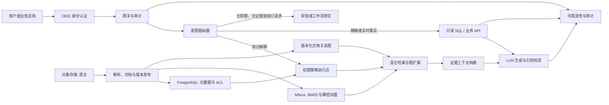

# 企业工作流 RAG 技术选型与架构

## 1. 设计边界

系统的职责是发现并引用已授权证据，而不是替代 ERP、CRM、OA、工单或数仓等系统记录源。向量检索只是检索手段之一，不承担实时状态、精确计算、权限判定或执行动作。

P1 是中小规模闭环，P2 验证中等规模 Graph RAG，P3 已运行 TechQA 全量 28,481 文档的 Milvus 持久化实验。跨地域多活、真实多租户和用户所称的 SAG 大规模架构仍留在真实部门试点之后。

## 2. 总体架构



所有响应都必须携带 `trace_id`。任何用于生成答案的文档分块或工具结果，均必须记录资源 ID、版本、权限决策和引用位置。

## 3. P1 技术选型

| 能力 | P1 选型 | 选择理由 | 后续演进条件 |
|---|---|---|---|
| 原始文件 | MinIO 或兼容 S3 的对象存储 | 原文、解析产物和版本可独立管理 | 企业已有对象存储时直接复用 |
| 元数据与权限映射 | PostgreSQL | 事务、版本、关系查询和运维成熟 | 分域/多租户时继续作为控制面 |
| 关键词与向量检索 | P3 当前使用 Milvus；OpenSearch 保留为候选 | 同一 collection 支持 BM25 稀疏向量、Nemotron 稠密向量、ACL 字段和持久化版本 | 真实企业试点再对比 OpenSearch 的运维、全文能力和成本 |
| 图关系 | 当前使用版本化 JSON 邻接图；PostgreSQL + Apache AGE 为企业试点目标 | 当前实现便于验证关系、路径、ACL 与版本语义；真实试点需持久化控制面和事务协调 | 多跳遍历或图规模成为瓶颈时评估 NebulaGraph/JanusGraph |
| 文档解析 | Docling 为主，Apache Tika 和 PaddleOCR 为补充 | 覆盖 Office/PDF/HTML，扫描件可使用 OCR 兜底 | 根据实际文件失败样本扩展解析器 |
| 服务编排 | Python + FastAPI | 便于集成解析、检索、评测和模型服务 | 长耗时审批/索引任务在 P3 评估 Temporal |
| 模型服务 | vLLM，OpenAI 兼容 API | 支持自托管模型、流式响应和多模型对比 | 可替换为企业批准的托管模型 |
| 向量模型 | NVIDIA [Nemotron-3-Embed-1B-BF16](https://huggingface.co/nvidia/Nemotron-3-Embed-1B-BF16)；BGE-M3 对照 | 1.14B、多语言（含中文）、32K 上下文；以 1024 维切片作为 P1 索引起点，兼顾质量与索引成本 | 对比 1024/2048 维、BGE-M3 和 P2 的 8B 版本后决策 |
| 重排模型 | P1 默认不启用 | MiniLM 对照使 Top-1 从 87.5% 降至 82.5%、P95 增至 442.46 ms | 仅在域内金标证明增益后启用其他候选 |
| 身份与策略 | OIDC/OAuth2 + OPA | 标准身份声明与可版本化策略 | P1 可用模拟 IdP；P3 对接企业 SSO |
| 观测 | OpenTelemetry + Prometheus + Grafana | 关联链路、延迟、错误和容量指标 | P3 增加集中日志与告警值班 |

选型是 P1 基线而非不可替换的产品承诺。`Nemotron-3-Embed-1B-BF16` 发布于 2026-07-16，模型卡声明其支持 34 种语言、输出 2048 维向量并支持切片至 1024/512 维；P1 使用 1024 维索引以控制存储成本，保留原模型版本以便重建。`Nemotron-3-Embed-8B-BF16` 在模型卡中声明其截至同日位列多语言 RTEB 榜首，但因 8B 参数和 4096 维输出，仅作为 P2 的质量上限候选。两者采用 OpenMDW-1.1 许可证，生产使用前须完成许可证和企业法务审查。

### 3.1 当前可执行切片

仓库保留内存索引用于快速测试，P3 正式规模实验使用 Milvus Standalone、etcd 和 MinIO：28,481 篇文档形成 147,358 个分块，每个版本对应独立 collection，并通过 alias 原子发布和回滚。PostgreSQL 控制面、对象存储、OPA 和企业 OIDC 仍是进入真实部门试点时需要补齐的组件。

实测模型对照如下：Nemotron 1024 和 2048 的 Recall@3 均为 96.25%、Top-1 均为 87.5%，2048 没有质量收益；BGE-M3 为 96.25%/85%；MiniLM 重排为 96.25%/82.5%。因此默认配置固定为 Nemotron 1B、1024 维、无重排器。

## 4. 数据与索引模型

### 4.1 原始资源模型

```text
Document(
  document_id, source_uri, owner, business_class, sensitivity,
  allowed_roles, status, version, effective_at, expires_at,
  checksum, parser_version, indexed_at
)
Chunk(
  chunk_id, document_id, version, position, content, content_hash,
  page_anchor, heading_path, allowed_roles
)
```

`Chunk.allowed_roles` 是源文档策略的展开结果。文档升级、失效、撤权或删除时，必须原子地更新或移除对应关键词、向量和图索引。

### 4.2 图模型（P2）

P2 只建立可解释的业务图，不自动把所有抽取实体都当作可信知识：

```text
Document -[:CONTAINS]-> Section -[:CONTAINS]-> Chunk
Document -[:SUPERSEDES|REFERENCES]-> Document
Chunk -[:MENTIONS {confidence, extractor_version}]-> Entity
Document -[:OWNED_BY]-> Owner
Document -[:CLASSIFIED_AS]-> Classification
```

`MENTIONS` 边为辅助召回信号，不能单独作为结论依据。只有原文分块和已授权工具结果可以用作最终引用。

### 4.3 P2/P3 当前实现

当前仓库使用 `VersionedKnowledgeGraph` JSON 快照验证图语义。P3 全量数据包含 7,600 条 `Document -[:REFERENCES]-> Document` 边；边来自正文中明确出现的文档 ID，不从相似度自动生成。查询先计算已授权文档 ID，再用这些 ID 构造邻接表并执行最多两跳遍历。

检索索引和关系图使用同一版本号发布并成对回滚。Milvus 向量/词法索引已实现持久化 collection 和 alias 切换；图快照仍写入本地 JSON。两者尚不是跨存储的原子事务，因此不能把当前实现描述为生产级 Graph RAG 集群。

## 5. 请求路由

路由器必须输出：`route`、`confidence`、`reason`、`required_filters` 和 `requires_citation`。低置信度不允许猜测，进入澄清或拒答分支。

| 路由 | 触发条件 | 执行方式 |
|---|---|---|
| `rag` | 企业专属、相对稳定、需要解释或跨文档综合 | ACL 过滤后的混合检索、重排、可选图扩展、基于证据生成 |
| `exact_search` | 编号、条款号、错误码、名称、版本或精确文本定位 | 字段过滤 + 关键词搜索；返回当前生效原文 |
| `tool` | 实时状态、结构化事实、聚合计算、系统配置 | 受控只读 SQL 或业务 API；结果作为事实来源 |
| `handoff_or_refuse` | 无权限、没有证据、请求执行动作、路由不确定 | 说明限制或转交获授权工作流 |

通用常识不进入企业索引。模型可直接回答稳定常识；对需要最新外部信息的问题，后续可接入获批准的外部搜索工具，但 P1 不启用。

## 6. 检索与生成流程

1. 网关验证 OIDC 身份，获得用户、角色、租户和数据域声明。
2. 路由器识别请求类型，提取版本、时间、资源 ID 等精确过滤条件。
3. 策略执行点计算允许访问的文档范围，并将限制作为 OpenSearch、图查询和工具调用的前置过滤器。
4. P3 正式配置分别执行带 ACL 的 Milvus BM25 和稠密向量召回，在应用侧按 0.3/0.7 融合，从扩大 30 倍的候选池中返回前三个不同文档且不启用重排；Graph 意图或显式 Graph 模式从最多两个已授权种子出发，在已授权子图中扩展两跳。使用 Nemotron-3-Embed 时，查询使用 `query: ` 前缀、文档使用 `passage: ` 前缀，并对切片后的向量重新 L2 归一化。
5. 上下文构建器去重、保留标题路径和页面锚点，限制总 token，并要求每个关键主张关联证据。
6. 生成器只基于证据回答；无足够证据时输出拒答，不得以模型先验补全企业事实。
7. 响应记录引用、路由、权限策略版本、模型版本、延迟和用户反馈入口。

## 7. SQL/API 工具安全边界

- P1 仅开放 BIRD 数据库的只读连接，使用独立数据库用户、schema 白名单和查询超时。
- 模型生成的 SQL 先经 SQL AST 校验：只允许 `SELECT`、限定表、限定函数和行数上限。
- 工具结果必须带查询时间、数据源、schema 版本和字段口径；不得把返回明细永久写入 RAG。
- P3 对接业务 API 时，API 本身仍需根据用户身份重新鉴权，RAG 服务不能代替业务系统授权。

## 8. 权限与安全要求

- 控制面保存“分类 -> 默认角色”的版本化映射，支持文档/分块级覆盖。
- 所有索引文档包含 `tenant_id`、`document_id`、`version`、`status` 和 ACL 过滤字段；查询必须带过滤条件。
- 禁止先全局向量召回、再由模型或应用层过滤文本。
- 原文、索引、日志和备份采用企业批准的加密与保留策略；审计日志不得存储不必要的全文上下文。
- 索引任务、查询服务和模型服务使用最小权限服务账号，密钥由企业密钥管理系统管理。
- 对提示注入、越权诱导和数据外泄问题设置回归测试；外部工具和链接默认不信任。

## 9. 阶段扩展策略

P3 已验证单域全量索引、可恢复写入和持久化版本，但尚未完成真实企业数据域。P4 的 SAG 架构必须在以下决议完成后实施：

- 正式定义 SAG 的职责、吞吐、索引规模、租户隔离和可用性目标。
- 以数据域进行物理或逻辑分片，避免跨域全局检索。
- 控制面保留在 PostgreSQL；检索、图和工具执行面可以水平扩展。
- 建立异步增量索引、失败重试、死信处理、容量压测和灾难恢复演练。
- 以 P3 真实流量的召回、延迟、成本和权限审计数据作为扩容依据。

## 10. 评测与运行指标

当前评测输出路由、Recall@3、Top-1、MRR@3、nDCG@3、Graph 路径与增益、拒答、权限隔离、工具答案、答案片段命中率、P50/P95 和 Wilson 置信区间。P3 严格 Top-3 结果为基础 Recall@3 65%、Top-1 62.5%，因此仍阻断发布。进入生产试点前还需增加事实一致性、并发容量、单请求成本、撤权时效和恢复时间。每次模型、提示词、切块策略、索引或权限策略变更均运行回归评测。
