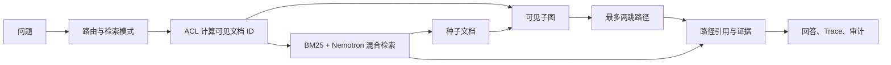

# P2 Graph RAG 执行与验收报告

## 1. 执行结论

P2 已作为实验阶段启动并完成第一轮可运行实现。它在 P1 之上增加了中等规模语料、显式文档关系、ACL-first 图扩展、图路径引用、索引/关系同版本发布、运行期成对回滚和 Graph/Hybrid 对照评测。

数据准备、切块、嵌入、Hybrid 检索、Graph RAG、权限和评测的逐步原理见 [端到端实现原理与教学](06-端到端实现原理与教学.md)。

Graph RAG 专项门槛全部通过，但 P2 整体未放行。阻断项仍是 P1 Top-1 引用正确率：扩大到 1,000 文档后为 86.25%，低于 95% 门槛。启动 P2 是用户明确要求的实验执行，不等同于修改或绕过 P1 阶段门槛。

## 2. 数据与图规模

| 工件 | 实际规模 | 边界 |
|---|---:|---|
| TechQA 文档 | 1,000 篇 | P1 200 篇、训练集上下文、显式引用目标和确定性干扰文档 |
| 文档关系 | 307 条 | 只提取正文明确出现的 `swg...` 引用，关系类型为 `REFERENCES` |
| P2 金标 | 180 题 | P1 120 题 + 40 跨文档 + 20 图越权 |
| 权限角色 | 3 类 | `engineering`、`operations`、`restricted` |

全部关系端点都存在于当前文档集；不存在重复边。图越权题的源文档对测试角色可见，目标文档不可见，用于验证遍历前权限裁剪。

## 3. 请求链路

权限过滤发生在邻接表构建前。未授权节点不会进入遍历队列、响应路径、引用或审计来源 ID；可见源文档正文中若出现不可见文档 ID，对应整行在回答构建时脱敏。Graph 模式保留种子文档，然后按路径置信度加入关联文档；普通 P1 问题默认不扩图。

## 4. 版本发布与回滚

`POST /v1/index/publish` 使用一个版本号同时发布文档增量和关系增量。发布期间查询与索引变更由同一进程锁隔离；任一侧失败时恢复原活动版本。`POST /v1/index/rollback/{version}` 只允许检索索引和关系图都存在该版本时成对回滚。

当前关系快照持久化为 JSON，向量快照只在运行期保留。服务重启后的跨版本文档恢复尚未实现，因此该机制是 P2 行为验证，不是生产级发布系统。

## 5. 正式评测结果

固定配置：RTX 4060 Ti 16 GB、Nemotron 3 Embed 1B、1024 维、BM25/向量各 0.5、无重排器、串行查询。

| 指标 | Nemotron | 门槛 | 状态 |
|---|---:|---:|---|
| 路由正确率 | 100% | >=90% | 通过 |
| P1 Recall@3 | 95% | >=85% | 通过 |
| P1 Top-1 引用 | 86.25% | >=95% | 阻断 |
| Graph 联合 Recall@3 | 100% | >=80% | 通过 |
| Graph 目标 Recall@3 | 100% | >=85% | 通过 |
| Graph 路径正确率 | 100% | >=95% | 通过 |
| 纯 Hybrid 目标 Recall@3 | 17.5% | 对照项 | - |
| Graph 召回增益 | +82.5 个百分点 | >=15 | 通过 |
| Graph ACL 隔离 | 100% | 100% | 通过 |
| 整体权限隔离 | 100% | 100% | 通过 |
| 拒答正确率 | 100% | >=90% | 通过 |
| P50 / P95 | 369.54 / 1,091.13 ms | 实验基线 | - |
| 索引时间 | 321.61 s | 实验基线 | - |

Hashing 对照的 Graph 目标召回、联合召回、路径和 ACL 同样为 100%，相对 Hybrid 增益为 80 个百分点；Nemotron 的 P1 Recall@3 和 Top-1 均更高，因此仍是默认模型。

## 6. 自动化与界面

- 16 个自动化测试覆盖 P1 回归、图 ACL、两跳无环遍历、图状态持久化、增量发布和成对回滚。
- 查询接口支持 `auto`、`hybrid`、`graph` 三种检索模式。
- 引用携带 `retrieval_mode` 和 `graph_path`；响应元数据包含活动索引版本和完整路径。
- 工作台增加图路径、图索引状态、关系类型、活动版本和 10 项 P2 评测指标。

## 7. 未完成项与阶段门槛

1. 修复 1,000 文档规模下的 P1 Top-1 排序，目标从 86.25% 提升到至少 95%。
2. 完成 PDF、DOCX、PPTX、XLSX、HTML 和扫描 PDF 的 P1.1 准入测试。
3. 用 PostgreSQL/OpenSearch/Apache AGE 适配器替换单机内存实现，并实现持久化原子版本发布。
4. 增加并发、故障恢复、图规模和增量索引压测。
5. 真实部门语料必须只建立已确认的引用、版本和所有权关系；自动抽取的实体边不能作为事实引用。

在以上门槛完成前，不进入 P3 企业试点，也不启动 SAG 大规模架构。
