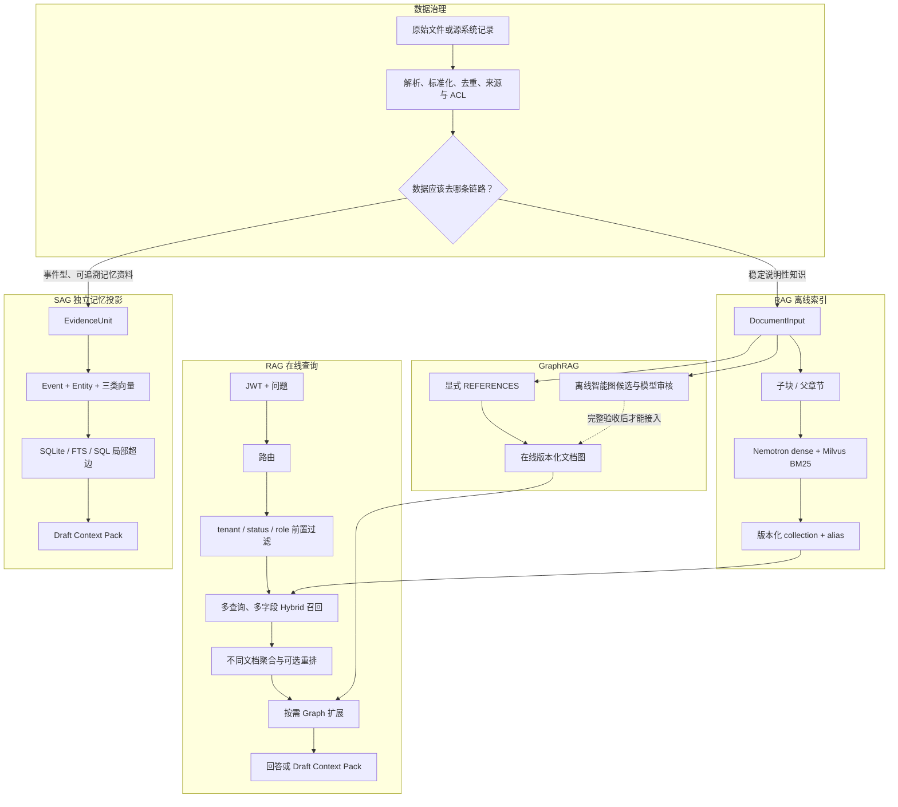

# Enterprise RAG、GraphRAG 与 SAG：端到端实现原理与教学

## 1. 文档范围与系统边界

这份文档按当前仓库的真实代码解释三套彼此相关、但边界不同的系统：

1. `enterprise_rag`：面向企业文档问答的 ACL-first Hybrid RAG / GraphRAG 服务；
2. 智能知识图谱构建流水线：离线抽取、模型审核、完整性校验和图工件发布；
3. `enterprise_sag`：SQL-Retrieval Augmented Generation 记忆基础设施，以及独立的时序记忆账本。

最重要的边界是：GraphRAG 与 SAG 不是同一个索引，也不是两个名字不同的“向量库”。GraphRAG 从文档和显式关系出发，解决企业知识问答与跨文档关系检索；SAG 从 Evidence、Event 和 Entity 出发，用 SQL JOIN 在查询时构造局部关系，生成供人工审阅的 Context Pack。当前两者都没有自动向 Agent Prompt 写入内容。

主要代码入口：

- RAG 数据准备：[prepare_p2_data.py](../scripts/prepare_p2_data.py)、[expand_p3_gold.py](../scripts/expand_p3_gold.py)、[curate_p3_gold.py](../scripts/curate_p3_gold.py)
- 多格式解析：[parsing.py](../src/enterprise_rag/parsing.py)
- RAG 分块：[chunking.py](../src/enterprise_rag/chunking.py)
- 嵌入模型：[embeddings.py](../src/enterprise_rag/embeddings.py)
- 检索特征与文档聚合：[retrieval.py](../src/enterprise_rag/retrieval.py)
- Milvus 存储与检索：[vector_store.py](../src/enterprise_rag/vector_store.py)
- GraphRAG：[graph.py](../src/enterprise_rag/graph.py)、[graph_retrieval.py](../src/enterprise_rag/graph_retrieval.py)
- RAG 服务：[service.py](../src/enterprise_rag/service.py)、[main.py](../src/enterprise_rag/main.py)
- LLM 重排与回答：[reranking.py](../src/enterprise_rag/reranking.py)、[answering.py](../src/enterprise_rag/answering.py)
- 智能图构建：[knowledge_extraction.py](../src/enterprise_rag/knowledge_extraction.py)、[knowledge_graph.py](../src/enterprise_rag/knowledge_graph.py)
- SAG：[enterprise_sag](../src/enterprise_sag)
- 统一评测：[evaluate_p2.py](../scripts/evaluate_p2.py)

## 2. 先看全貌：四条数据流



四条流分别解决不同问题：

- 离线索引流把受治理文档变成可检索资产；
- 在线查询流把用户问题变成带权限、引用和审计的回答；
- 图构建流生产经过证据与完整性校验的关系；
- SAG 流把资料和时序事实变成独立、可审阅的记忆投影。

`documents.jsonl` 只是治理后的输入，不是向量库；`relations.jsonl` 只是图边输入，不是完整知识图谱；SAG 的 SQLite 也只是可重建读投影，不是不可变事实本身。

## 3. 哪些数据进入 RAG，哪些不进入

项目先做数据路由，再做嵌入。判断标准不是“能不能转成向量”，而是“什么系统才是该事实的权威来源”。

| 数据类型 | 当前链路 | 原因 |
|---|---|---|
| 企业专属、相对稳定、需要语义解释的制度和技术文档 | Hybrid RAG | 适合语义召回、上下文解释和来源引用 |
| 文档间明确的引用、替代、适用关系 | 条件式 GraphRAG | 关系本身比文本相似度更可靠 |
| 文档号、错误码、版本号 | 精确检索或 feature BM25 | 标识符必须精确命中，不能依赖近义语义 |
| 订单、余额、销售额等实时结构化事实 | 只读 SQL/API 工具 | 业务系统才是权威记录源 |
| 审批、删除、提交等有副作用的请求 | 拒答或转工作流 | RAG 不能替代业务授权与事务系统 |
| 邮件和即时通信原始流 | 不进入当前企业 RAG | 增量杂乱、重复多、版本与责任边界不稳定；标题或 ID 可走精确检索 |
| 通用常识、公开百科 | 不进入企业专属索引 | 增加成本、噪声和过期风险，通常不增加企业独有证据 |
| 经人工选择、需要长期追溯的事件型资料 | 独立 SAG 投影 | 需要 Event、Entity、时间与来源，而不只是文档相似度 |

这也是为什么“把所有文件都嵌入”不是大规模 RAG 的正确起点。索引规模扩大后，近重复文档会显著增加排序难度；无价值数据不仅花钱，还会挤占 Top-K 的证据预算。

## 4. 原始资料如何变成标准文档

### 4.1 当前代理数据

P3 使用 NVIDIA TechQA-RAG-Eval 作为公开代理语料，验证企业技术支持知识的处理链路。当前工件为：

| 工件 | 数量 | 用途 |
|---|---:|---|
| 文档 | 28,481 | 全量 Hybrid / GraphRAG 规模实验 |
| 显式 `REFERENCES` | 7,600 | 在线可信文档图 |
| 金标 | 240 | 路由、检索、图、权限、拒答和工具 |
| 实际计分金标 | 235 | 5 道证据错配题保留审计但不计分 |
| 普通 RAG | 120，计分 115 | 基础语义检索与排序 |

TechQA 不是企业内部数据，也不证明真实部门权限和 SLA。它只允许我们先把处理、索引、检索、图和评测闭环跑通。

### 4.2 标准模型与治理字段

所有 RAG 文档先转换为 `DocumentInput`：

```json
{
  "document_id": "swg21294023",
  "title": "IBM JIT Problem Determination ...",
  "content": "原始正文",
  "owner": "techqa-proxy-owner",
  "business_class": "engineering-support",
  "sensitivity": "internal",
  "allowed_roles": ["engineering"],
  "version": "techqa-p2-2026-07-18",
  "status": "active",
  "source_uri": "hf://nvidia/TechQA-RAG-Eval/corpus/swg21294023.txt"
}
```

这里有三个不同的身份维度：

- `document_id`：知识对象的稳定标识，也是精确检索和文档图节点；
- `version + checksum`：识别内容版本和变化；
- `source_uri + owner`：回到原始证据和责任人。

`allowed_roles` 不允许为空。TechQA 的角色由实验规则生成，P3 分布为 11,690 篇 `engineering`、8,275 篇 `operations`、8,516 篇 `restricted`。真实企业接入不能用关键词猜权限，必须继承源系统 ACL，或由数据责任人确认“分类到角色”的映射。

数据准备还会按 `document_id` 去重、计算正文 SHA-256、写入 `manifest.csv` 和 `summary.json`，并使用确定性顺序保证同一输入可以重建相同数据集。

### 4.3 多格式解析

[parsing.py](../src/enterprise_rag/parsing.py) 将 PDF、DOCX、PPTX、XLSX、HTML、Markdown 和文本统一为 `ParsedDocument`：

```text
文件
  -> Docling 主解析器
  -> 格式专用降级解析
  -> 扫描 PDF 标记 needs_ocr 并尝试 OCR
  -> 页眉、页脚、页码抑制
  -> 标题、段落、列表、表格识别
  -> 页码 / 章节 / 哈希 anchors
  -> to_document_input
```

表格与散文正文分流，解析失败、降级原因和 OCR 状态都会显式返回，不允许静默丢文档。当前 TechQA 全量实验输入本来就是 `.txt`，所以 P3 指标不能被解释为已经验收了真实 PDF、Office 和 OCR 准确率。

## 5. 文档怎样切成可检索单元

### 5.1 为什么不能直接嵌入整篇文档

整篇长文往往同时包含问题、环境、原因、解决步骤和参考链接。只生成一个向量会把这些语义平均掉；切得过碎又会丢失完整因果和操作步骤。因此当前代码明确区分“召回单元”和“回答证据单元”。

### 5.2 旧字符分块

历史正式 P3 索引 `p3-techqa-28481-nemotron-1024-v3` 使用：

- 最大目标长度 900 字符；
- 重叠 100 字符；
- 优先按空行分段；
- 超长段落使用滑动窗口。

该索引包含 147,358 个分块。它仍是 `run_p3_nemotron_server.cmd` 挂载的历史基线，而不是已经被新实验自动替换。

### 5.3 结构感知父子分块

当前代码新增 `structured-parent-child-v1`。它使用确定性的近似 token 计数器识别 Markdown 标题、编号标题和 TechQA 的 `CAUSE`、`ANSWER`、`RESOLVING THE PROBLEM` 等章节：

```text
Document
  -> 章节树 heading_path
  -> 最大 1,200 token 的 parent section
  -> 最大 384 token、重叠 64 token 的 child chunk
```

子块用于 dense/BM25 召回；父章节用于重排输入和最终证据。`Chunk` 同时保存：

- `parent_id`、`parent_content`；
- `section_title`；
- `chunking_version`；
- `token_count`。

父章节必须在文档候选形成后、LLM 重排前补全。如果只在 Top-3 排完后才补父块，重排器看到的仍是残缺子块，会出现“召回改善、最终排序反而变差”。这是本轮代码调整最重要的抽象边界之一。

结构化消融使用独立 alias，不污染历史索引：

| 子块参数 | 分块数 | 原生 Recall@20 | 原生 Recall@3 | 原生 Top-1 |
|---|---:|---:|---:|---:|
| 384/64 | 82,228 | 94.55% | 65.45% | 47.27% |
| 320/48 | 97,288 | 92.73% | 65.45% | 45.45% |
| 256/48 | 119,467 | 94.55% | 70.91% | 41.82% |

这些是同一历史 55 题、Top-20 文档候选契约下的消融结果，不是 235 道新金标的正式发布指标。

### 5.4 分块契约为什么必须版本化

同一个 collection 里的向量必须来自兼容的解析器、分块算法、嵌入模型和维度。离线索引脚本已经记录并检查 `chunking_version`，断点续传时若版本不一致会拒绝继续。

当前 RAG 在线上传接口会使用运行配置切块，再把旧版本未覆盖的行继承到新 collection，但尚未像 SAG 的 Pipeline Contract 一样强制证明整个新快照只有一种兼容分块契约。因此，向历史 `900/100` 索引在线追加结构化分块可能形成混合契约；真实发布前应把这项校验提升为 RAG 控制面的硬门禁。

## 6. 分块如何变成向量与持久索引

### 6.1 Nemotron 嵌入

检索文本为：

```text
passage: {title}\n{child_content}
```

查询文本为：

```text
query: {question}
```

Nemotron 3 Embed 1B 原始输出经过归一化后截取前 1,024 维，再做一次 L2 归一化：

```text
v_normalized = v / max(||v||₂, 1e-12)
```

归一化后，向量内积等价于余弦相似度。1024 维 `float32` 每条纯向量约 4 KiB；历史 147,358 分块只计算 dense 向量就约 575.6 MiB，还不包含正文、稀疏向量和 Milvus 索引开销。

`HashingEmbeddingProvider` 只用于确定性的测试和冒烟，不能代表语义质量。

### 6.2 Milvus 中保存什么

每行不仅有一个 dense 向量，还包括：

| 字段组 | 主要字段 | 作用 |
|---|---|---|
| 身份 | `chunk_id`、`document_id`、`version`、`position` | 稳定定位与版本追踪 |
| 内容 | `title`、`content`、`parent_content`、`section_title` | 召回、重排和回答证据 |
| dense | `dense` | Nemotron 语义召回 |
| 综合 BM25 | `search_text -> sparse` | 文档号、标题和正文 |
| 标题 BM25 | `title_text -> title_sparse` | 长问题中的标题意图 |
| 特征 BM25 | `feature_text -> feature_sparse` | 产品、组件、错误码和版本 |
| 权限 | `status`、`tenant_id`、`allowed_roles`、`roles_key` | 检索前过滤和结果复核 |
| 分块契约 | `parent_id`、`chunking_version`、`token_count` | 父子展开与兼容性审计 |

Milvus Lite 和 Standalone 使用同一适配器。Standalone 给稀疏字段建立索引；当前 Milvus Lite 版本因实现限制不建立 sparse index，但仍能计算 BM25，适合小规模本地验证。

### 6.3 版本、断点续传和原子发布

每个索引版本对应独立 collection：

```text
enterprise_chunks__<sanitized_version>
```

构建流程是：

1. 创建未发布 collection；
2. 按完整文档分段切块、嵌入和写入；
3. 通过 `position == 0` 找出已经完成的文档并断点续传；
4. 校验最终文档 ID 集与 corpus 完全相等；
5. flush 并加载 collection；
6. 原子切换稳定 alias。

在线查询只访问 alias，因此构建中途失败不会暴露半成品。回滚也是把 alias 指向旧 collection。图快照仍存为本地 JSON，所以向量 alias 与图版本之间是应用层成对切换，不是跨存储的数据库事务。

## 7. 在线 Hybrid 检索怎样执行

### 7.1 路由先决定检索范式

规则路由器输出四种 route：

1. 有副作用的创建、删除、审批请求：`handoff_or_refuse`；
2. 汇总、计数等结构化问题：`tool`；
3. 文档号、错误码、版本号：`exact_search`；
4. 其他企业知识问题：`rag`。

请求另有 `retrieval_mode=auto|hybrid|graph`。`auto` 只有在路由器判断存在“引用、关系、多跳”意图时开启 Graph；`graph` 用于显式实验或用户指定；普通问答默认不扩图。

### 7.2 ACL 在任何打分之前执行

JWT 解析为 `Principal(subject, tenant_id, roles)`。Milvus 查询表达式首先限制：

```text
status == "active"
AND tenant_id == 当前请求租户
AND roles_key 命中当前用户至少一个角色
```

角色名先经过白名单校验，再编码为 UTF-8 十六进制 token。这样 `engineering_team` 中的下划线不会被 Milvus `LIKE` 当成单字符通配符。每个 ANN/BM25 分支都携带同一 filter，返回结果还会再次核验 status、tenant 和角色。

当前一个 `MilvusHybridStore` 绑定一个部署租户；请求 tenant 与 store tenant 不一致时直接返回空集。这证明了租户边界的执行方式，但不是一个实例内的完整动态多租户分区方案。

### 7.3 原问题与聚焦问题并行

开启 query rewrite 后，系统保留原问题，同时确定性生成聚焦问题：

```text
原问题第一行 + 产品 + 组件 + 错误码/异常 + 版本约束
```

例如长日志不会被整个删除；完整问题仍负责保留上下文，聚焦问题负责让核心产品和错误码获得独立召回机会。这里没有调用生成模型，因此同一问题必然得到相同 rewrite。

### 7.4 多字段召回与应用侧重算

字段化模式最多包含：

- 原问题 dense；
- 聚焦问题 dense；
- 原问题综合 BM25；
- 聚焦问题综合 BM25；
- 聚焦问题标题 BM25；
- 显式产品/组件/标识符/版本 feature BM25。

`separate` 模式分别查询每个分支后在应用侧合并；`native_rrf` 把多个 `AnnSearchRequest` 交给 Milvus，用 RRF 合并，减少网络往返。所有 native 分支都各自携带 ACL filter，不能只把 filter 放在 `hybrid_search` 顶层。

Milvus 主要承担“可扩展、高召回、带 ACL 的候选层”。候选取回后，应用复用经过验证的词法逻辑重新计算：

```text
hybrid = (1 - dense_weight) * lexical + dense_weight * dense
hybrid += bounded_feature_boost
```

历史正式配置使用 `dense_weight=0.7`。产品、组件、标识符和版本只提供最高 0.2 的有界正向加分，不做硬过滤，避免因为特征抽取漏识别而误杀正确文档。

### 7.5 从 chunk 候选变成文档候选

评测单位和最终引用单位都是文档，因此不能让同一长文档的三个相邻 chunk 占满 Top-3。当前流程是：

1. 扩大 chunk 候选池；
2. 按 `document_id` 聚合；
3. 每个文档最多保留 3 个不同片段；
4. 用标识符覆盖、问题词覆盖、显式特征和基础分数选择 `evidence_hit`；
5. 重排器比较不同文档；
6. 最终严格返回不同文档。

当需要重排 20 个文档时，初始 chunk 预算按 `20 × search_multiplier` 计算，而不是按最终 Top-3 计算。开启 adaptive recall 后，如果不同文档不足 20，就将 chunk limit 倍增，最多到 4,096；仍不足会显式失败，不能假装完成公平的 Top-20 重排。Graph allow-list 较小时，目标数量会裁到 allow-list 的实际大小，避免无限扩张；Milvus 结果窗口同时硬限制为 16,384。

### 7.6 可选 LLM 重排

`LlmReranker` 只接收已经通过 ACL 的文档候选，不会引入新文档。候选文本包含文档 ID、标题、版本，以及最多三个问题相关片段；结构化索引会在此之前批量补全父章节。

支持两种排序策略：

- `replace`：完全采用模型给出的文档顺序；
- `weighted_rrf`：融合基础名次与模型名次。

实验表明基础排序较弱时，0.5 权重的 weighted RRF 会把模型已经排对的文档拉低，因此当前质量实验选择 `replace`，但这不是默认在线能力。

为了让外部模型 A/B 可复现，缓存键覆盖模型、提示词、问题、候选正文和候选顺序。`record` 遇到调用失败或无效 JSON 会中止，不写不完整缓存；`replay` 遇到 cache miss 会中止，证明候选生成发生了漂移。报告还记录 judgement digest、cache hit、HTTP 尝试和降级次数。

通用 MS MARCO CrossEncoder 在该域上产生负收益，因此仍不默认启用。LLM 重排能提高 Recall，但外部调用延迟、成本和温度为 0 仍可能出现的服务端波动，都决定它目前只能作为隔离实验。

## 8. GraphRAG 怎样工作

### 8.1 当前在线图是什么

当前在线图仍使用 7,600 条正文中明确出现的 `REFERENCES`：

```text
Document(source) -[:REFERENCES]-> Document(target)
```

每条边保留关系类型、置信度和证据 anchor。`SUPERSEDES`、`RELATED_TO` 已在模型中预留，但当前 TechQA 在线图的正式边仍全部是显式引用。

### 8.2 查询时如何扩展

GraphRAG 先运行 Hybrid 得到种子。如果问题标题明确匹配文档，还会优先补充 title seed。随后：

1. 计算用户授权文档 ID 集；
2. 只用两端都在授权集中的边构造邻接表；
3. 从最多两个种子执行最多两跳 BFS；
4. 排除环路，并限制最多 12 条扩展路径；
5. 只在目标文档 allow-list 内再次执行带 ACL 的检索；
6. 返回文档、关系类型和完整路径。

图分数为：

```text
graph_score = seed_score * path_confidence * 0.82 ^ hop_count
```

权限不是在遍历后过滤；未授权节点根本不会进入邻接表，所以不能充当中间跳板，也不能通过路径元数据泄漏名称。

### 8.3 为什么 Graph 不能对所有问题强制开启

历史 40 道专门的跨文档题中，Graph 目标、联合和路径 Recall 均为 100%，说明显式引用对关系题有效。

但在同一批当前 Gold 的 55 道普通 RAG 题上，强制 Graph 后：

| 重排模型 | Hybrid Recall@3 | 强制 Graph Recall@3 | Top-1 |
|---|---:|---:|---:|
| DeepSeek | 85.45% | 78.18% | 都是 58.18% |
| Luna | 87.27% | 76.36% | 都是 60.00% |

原因是当前结果按“基础第一名、图邻居、基础剩余候选”组织。它保护了第一名，却可能让图邻居挤掉原本正确的第二、第三名。正确结论不是“Graph 无效”，而是 Graph 必须由关系意图触发；未来应把 base 与 graph 候选放进同一排序层，而不是占固定插槽。

## 9. 智能知识图谱如何构建

显式引用图可靠但关系类型有限。新增长期图构建流水线尝试从文档中抽取章节、实体、别名和证据关系：

```text
文档
  -> 规则解析章节和确定性实体/关系候选
  -> Terra 审核文档结构
  -> Terra 审核节点类型并补充遗漏实体
  -> 规范化实体名和别名
  -> Terra 审核规则关系并抽取新增关系
  -> 证据存在、端点类型、自关系等确定性防线
  -> 节点 / mention / relation / document projection 工件
```

模型不能凭空创建无证据关系。确定性防线只能拒绝不安全的模型结果，不能替模型批准未审核关系。

v5 进一步把“审核完整性”做成发布契约：

- accepted/corrected/rejected 必须覆盖每一个候选实体 ID；
- accepted/rejected 必须覆盖每一个规则关系 ID；
- 缺失结构、实体或规则审核时定向补全；
- 缓存绑定正文 checksum 与 extraction version；
- 每个阶段都必须达到 100% coverage。

现有 v4 部分工件处理了 2,454/28,481 篇、生成 17,222 个节点和 6,778 条关系，但规则审核覆盖仅 51.038%，因此只能用于诊断。v5 全量构建被外部 `insufficient_user_quota` 阻断；它没有接入在线 GraphRAG，也不能被描述为已完成的企业知识图谱。详见 [知识图谱就绪报告](../reports/p3-knowledge-graph-readiness.md)。

## 10. 回答、引用、知识库与审计

### 10.1 两种回答模式

历史正式 P3 服务脚本显式使用 `EvidenceAnswerGenerator`。它从授权 hit 中选择与问题最相关的短窗口，输出可复现的摘录式回答。

代码同时支持 `CitationConstrainedAnswerGenerator`：把授权证据编号后发送给 OpenAI-compatible 模型，要求每个结论标注 `[n]`，证据不足时固定拒答，并删除 `<think>` 内容。模型不可用时可降级为摘录。受约束生成已有自动化测试，但尚无覆盖 235 道当前金标的正式生成质量放行报告。

### 10.2 引用和审计

引用包含来源 ID、标题、版本、anchor、分数、检索模式和 Graph 路径。生成答案、引用标题和完整响应前，还会脱敏当前用户无权访问的文档 ID，防止正文中的“参见受限文档”形成侧信道。

审计记录主体、角色、route、是否允许、命中来源、图使用情况、索引版本和 trace ID。反馈通过 trace ID 回连，支持 helpful、unhelpful、citation_error 和 permission_issue。

### 10.3 可审阅知识库接口

RAG 服务现已增加：

- `POST /v1/documents`：管理员提交标准 `DocumentInput`；
- `POST /v1/documents/upload`：解析多格式上传并发布新索引版本；
- `GET /v1/knowledge/sources`：分页、搜索且只返回当前主体有权看到的来源；
- `POST /v1/context-packs`：只执行检索和 token 编排，不调用答案生成器。

`ContextPackResponse.diagnostics` 明确记录 `agent_loop_integration=false` 和 `prompt_injection=false`。其中的 `DraftContextPack` 是人工审阅工件，不会自动成为 Agent 上下文。上传接口要求 `knowledge_admin`；索引和图状态允许管理员或安全审计员查看；普通来源目录仍受文档 ACL 约束。

## 11. SAG 为什么是另一套系统

### 11.1 SAG 的领域模型

本仓库中的 SAG 指 SQL-Retrieval Augmented Generation。它把资料转为：

```text
Source
  -> EvidenceUnit（可追溯原文）
  -> Event（可独立检索的事实陈述）
  -> Entity（进入关系网络的连接点）
```

Evidence、Event 和 Entity 分别生成 Nemotron 1024 维向量。SQLite 保存来源、证据、事件、实体、Event–Entity 连接和 FTS5；查询时通过 `event_entities` 自连接动态构造局部 SQL 超边，而不是预先聚类整张全局图。

RAG 的父子分块适合回答“哪段文档支持答案”；SAG 的 EvidenceUnit 默认目标 480 tokens、硬上限 640 tokens、无重叠，目的是避免相邻重叠块重复抽出同一个 Event。

### 11.2 SAG 查询流程

`ContextPackRequest` 先被 Planner 拆成 1–5 个 `EvidenceNeed`。每个 Need 独立执行 Event 向量、Evidence 向量、Entity 向量、FTS 和 SQL 超边召回，再由 Coverage Judge 判断候选是否直接支持该 Need。最后按 Need 权重、RRF、语义支持、去重和 token 预算生成 Draft Context Pack。

低质候选不会为了填满预算而进入结果；required Need 没有证据时明确标记 `uncovered`。每条结果保留 route rank、分数、SQL hop、共享 Entity、来源 anchor 和排除原因。

### 11.3 增量接入与不可变版本

SAG 已实现独立 `IncrementalIngestionService`：

```text
SourceAsset（namespace + source_key 的稳定身份）
└── SourceVersion（不可变版本）
    └── Source / Evidence / Event / Entity 派生投影
```

相同版本指纹重复上传返回 `unchanged`，不重复调用 LLM 或嵌入；正文相同但元数据改变会新增版本并复用派生投影。写版本、写派生索引、切换活动版本和增加 index generation 在一个 SQLite 事务内完成。

Pipeline Contract 覆盖解析器、分块、抽取器、抽取模型、嵌入模型和维度。增量请求与现有索引契约不兼容时拒绝发布，并要求全量重建。自动化测试验证：

```text
Incremental(Current, Delta).active_projection
== FullBuild(Current Sources).active_projection
```

这套严格契约是 RAG 在线增量发布下一步应该复用的系统性做法。完整说明见 [SAG 设计与运行](08-SAG记忆基础设施设计与运行.md) 和 [资料接入与增量索引](10-资料接入与增量索引.md)。

### 11.4 时序记忆账本

时序模块把 `MemoryEvent`、事实断言、断言关系、巩固运行和使用反馈保存为不可变追加层；`current_assertion_projection`、向量和 FTS 是可重建读投影。

系统同时区分现实生效时间和系统记录时间，因此能回答“事实在当时是否有效”和“系统当时是否已经知道”。支持 `supersedes`、`corrects`、`retracts`、`contradicts` 和 `reinforces`。旧事实一旦失效，即使过去使用次数很多，也不能进入 `latest_valid`。

当前活跃会话路径只允许追加原始事件，不运行 LLM；离线 `propose` 只生成 JSON 提案，人工审阅后显式 `apply` 才写入断言层。它仍未接入 Agent Loop、多租户 ACL 和自动调度器。详见 [时序记忆账本](09-时序记忆账本与离线巩固.md)。

## 12. 评测怎样证明系统真的改善

### 12.1 线上和离线使用同一组件工厂

[components.py](../src/enterprise_rag/components.py) 统一创建 embedding、chat model、reranker、store 和 answer generator。服务与评测共用它，避免“离线测的是 A，线上跑的是 B”。报告保存模型、维度、分块契约、搜索模式、权重、缓存和索引版本。

### 12.2 Gold 是受治理资产

当前 240 题中 235 题 `score_enabled=true`。逐题审阅状态为：228 条 verified、4 条 corrected、2 条 expanded、1 条 ambiguous、5 条 excluded。评测报告记录 Gold SHA 和审阅状态，Gold 不同的报告不能直接横比。

5 条 excluded 仍保留在 JSONL 中，目的是保留审计历史，而不是删除不利样本。它们不会进入门禁分母。

### 12.3 召回漏斗与主要指标

评测不只看最终 Top-3，还记录：

- Gold 是否进入 chunk 候选池；
- 是否进入 Top-20 不同文档；
- 重排前后名次变化；
- Recall@3、Top-1、MRR@3、nDCG@3；
- Graph 联合/目标/路径、Graph 相对 Hybrid 增益；
- 权限隔离、拒答、工具正确率；
- 答案片段命中与内容覆盖；
- P50/P95、外部调用、cache hit 和降级。

候选不在 Top-20 时，任何只重排 Top-20 的模型都不可能救回；Gold 已在 Top-20 但没有进 Top-3，才是重排问题。这一漏斗把“召回失败”和“排序失败”分开，避免盲目更换嵌入模型。

### 12.4 当前结果应怎样解读

| 实验 | 问题集 | Recall@3 | Top-1 | 结论 |
|---|---:|---:|---:|---|
| 历史全链路 P3 基线 | 180 题中的 80 道基础检索 | 65.00% | 62.50% | 仍是历史正式门禁，未通过 |
| 256/48 + Sol replace | 历史 55 道普通 RAG | 89.09% | 67.27% | 该 55 题上的最高综合质量；外部延迟高 |
| 当前 Gold + DeepSeek Hybrid | 同一 55 道 | 85.45% | 58.18% | Gold 变更后重新校准的 Hybrid 子集 |
| 当前 Gold + Luna Hybrid | 同一 55 道 | 87.27% | 60.00% | 同上，不能外推到 115 道计分 RAG |

这些数字的数据集、Gold SHA、分块和模型不同，不能画成一条连续“65% 上升到 89%”的曲线。当前最重要的缺口是：扩充后的 235 道计分金标尚未对最终候选、分块和重排配置完成一次全量正式评测。

历史小样本上的 100% 也不能等同于绝对安全。必须结合 Wilson 置信区间、权限对抗题和真实租户测试解读。

## 13. 用一个问题串起完整 RAG 流程

假设 `engineering` 用户问：“文档 A 引用的补丁文档是什么，它解决了什么问题？”

```text
1. JWT -> Principal(subject, tenant=demo, roles={engineering})
2. Router -> rag，并标记 graph_expansion=true
3. Milvus 每个分支前置 tenant/status/roles_key filter
4. 原问题 + 聚焦问题进入 dense、综合 BM25、标题和 feature 分支
5. 候选在应用侧重算并按 document_id 聚合
6. 取最多两个授权种子
7. 在授权子图内沿 REFERENCES 扩展最多两跳
8. 只在目标 allow-list 内重新检索证据片段
9. 组合基础与图候选，严格保留不同文档
10. 生成摘录或受约束回答
11. 返回 citation、anchor、graph_path、index_version 和 trace_id
12. 审计写入本次主体、route、来源和图使用情况
```

任一步没有足够授权证据都会拒答；未授权文档不会先参与召回再被丢弃，也不会作为图中间节点。

## 14. 如何复现主要链路

### 14.1 数据和 Gold

```powershell
.venv\Scripts\python.exe scripts\prepare_p2_data.py `
  --output data\processed\techqa_p3 `
  --documents 28481
.venv\Scripts\python.exe scripts\expand_p3_gold.py
.venv\Scripts\python.exe scripts\curate_p3_gold.py
```

### 14.2 Milvus 和历史基线

```powershell
docker compose -f docker-compose.milvus.yml up -d
scripts\index_p3_nemotron.cmd
scripts\evaluate_p3_nemotron.cmd
scripts\run_p3_nemotron_server.cmd
```

### 14.3 字段化与结构化实验

```powershell
scripts\index_p3_fielded.cmd
scripts\evaluate_p3_retrieval_ablation.cmd native_rrf

scripts\index_p3_structured.cmd
scripts\evaluate_p3_structured.cmd
scripts\evaluate_p3_chunk_ablation.cmd
```

LLM `record` 会产生外部 API 调用和费用；`replay` 必须使用完全相同的候选缓存。不要把缓存回放延迟当成真实线上模型延迟。

### 14.4 智能图和 SAG

```powershell
.venv\Scripts\python.exe scripts\build_p3_knowledge_graph.py

.venv\Scripts\python.exe -m enterprise_sag build `
  --extractor deepseek `
  --embedding-backend nemotron
.venv\Scripts\python.exe -m enterprise_sag panel
.venv\Scripts\python.exe -m enterprise_sag memory inspect
```

智能图全量运行需要外部模型额度，未达到所有阶段 100% coverage 时不得接入在线检索。

### 14.5 工程回归

```powershell
.venv\Scripts\ruff.exe check .
.venv\Scripts\pytest.exe -p no:cacheprovider
```

本次文档更新对应的工作区回归结果为 `244 passed`；唯一警告来自 FastAPI TestClient 对上游 `httpx` 适配层的弃用提示。

## 15. 当前完成度与下一步

已经完成：

- 28,481 文档的持久化 Milvus Hybrid RAG、断点续传和 alias 发布；
- ACL-first 检索、tenant/role 结果复核、Graph 授权子图与路径引用；
- 多查询、多字段召回、严格不同文档候选、自适应 Top-20 和可复现 LLM 重排；
- 结构化父子分块及“父块在 rerank 前补全”的正确边界；
- 可审阅知识库上传、来源目录和 Draft Context Pack；
- 240 题、235 题计分的 Gold 治理流程；
- SAG 独立记忆投影、文档级增量版本、时序账本和人工巩固工作流。

尚未完成：

1. 用 235 道计分金标对最终推荐配置做全量放行评测；
2. 将 base 和 graph 候选统一打分，替代固定插槽；
3. 完成 v5 智能图全量构建与 100% 审核覆盖；
4. 给 RAG 在线增量发布增加与 SAG 等价的全快照 Pipeline Contract；
5. 用真实企业数据验证源 ACL、撤权时效、动态多租户、并发、灾难恢复和成本；
6. 在质量可接受的前提下降低 LLM 重排延迟；
7. SAG 增加权限下推、离线评测和独立批准边界后，才讨论 Agent Loop 集成。

## 16. 一句话总结

这个项目已经不再是“把文档切块后塞进向量库”，而是把数据路由、解析治理、父子分块、Nemotron 嵌入、Milvus 多字段 Hybrid、文档级重排、ACL-first GraphRAG、知识图谱审核、可审阅 Context Pack、SAG 时序记忆和版本化评测组成一条可追溯链路；当前应继续把 RAG Pipeline Contract、智能图完整性和真实企业 ACL 补成发布硬门禁，确保不完整索引、未审核关系或未经授权证据无法进入最终回答。
