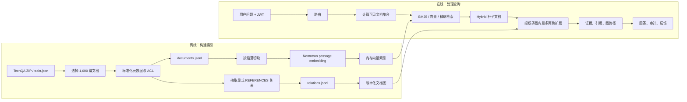
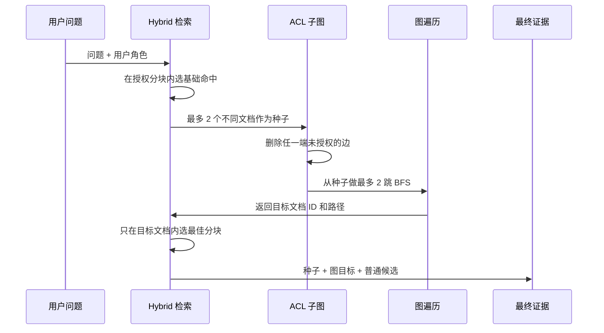

# Enterprise RAG P2：端到端实现原理与教学

## 1. 这份文档解决什么问题

这份文档不只描述系统“有什么功能”，而是沿着真实代码解释它“怎样工作”：

1. 原始数据为什么不能直接变成向量。
2. TechQA 原文如何经过筛选、标准化、权限标注、校验和切块。
3. 每个分块如何通过 Nemotron 3 Embed 变成 1024 维向量。
4. 关键词检索、向量检索和 Hybrid 检索如何组合。
5. Graph RAG 的关系从哪里来，查询时如何沿关系扩展。
6. 权限为什么必须在打分和图遍历之前执行。
7. 金标问题怎样生成，指标怎样计算，为什么当前仍未通过发布门禁。

文档描述的是本仓库当前已经运行的 P2 实验实现，而不是一套脱离代码的理想架构。涉及的主要代码位于：

- 数据准备：[prepare_p2_data.py](../scripts/prepare_p2_data.py)
- 文档与分块：[chunking.py](../src/enterprise_rag/chunking.py)
- 嵌入模型：[embeddings.py](../src/enterprise_rag/embeddings.py)
- Hybrid 检索：[retrieval.py](../src/enterprise_rag/retrieval.py)
- 文档图：[graph.py](../src/enterprise_rag/graph.py)
- Graph RAG 编排：[graph_retrieval.py](../src/enterprise_rag/graph_retrieval.py)
- 请求服务：[service.py](../src/enterprise_rag/service.py)
- 评测：[evaluate_p2.py](../scripts/evaluate_p2.py)

## 2. 先看全貌：系统有两条流水线

RAG 系统应分成离线索引流水线和在线查询流水线。前者把原始资料变成可检索资产，后者把一次用户问题变成带权限和引用的回答。



这里最容易混淆的地方是：`documents.jsonl` 还不是向量库。它只是已经治理过的文档输入。服务启动后仍需经过文档校验、切块、模型编码和索引提交，才真正具备向量检索能力。

## 3. 第一步：决定什么数据进入哪条链路

本项目首先做数据路由，而不是把所有数据都嵌入：

| 数据类型 | 当前处理方式 | 原因 |
|---|---|---|
| 企业专属且相对稳定的说明性知识 | Hybrid / Graph RAG | 需要语义理解、上下文解释和引用 |
| 文档号、错误码、版本号 | 精确关键词检索 | 标识符必须精确命中，向量相似不够可靠 |
| 销售额、订单数等结构化实时事实 | 只读 SQL 工具 | 数据库才是权威记录源 |
| 邮件、即时通信原始流 | 不进入当前 RAG | 增量杂乱、噪声高、缺少稳定版本和责任人 |
| 通用常识和公开百科 | 不进入企业索引 | 模型通常已具备，加入只会增加成本和干扰 |
| 删除、审批、提交等执行请求 | 拒答或转工作流 | 当前系统只允许只读问答 |

这一步的原理是：向量库是“语义证据索引”，不是企业所有数据的副本。每种数据应回到最权威、最容易控制一致性的检索方式。

## 4. 原始数据如何变成可索引文档

### 4.1 原始输入

P2 使用 NVIDIA TechQA-RAG-Eval 作为企业技术支持文档的公开代理语料：

- `data/raw/techqa/corpus.zip`：原始 `.txt` 文档集合。
- `data/raw/techqa/train.json`：问题、答案和对应上下文。
- `data/processed/techqa_websphere/`：P1 已确认的 200 篇文档和 120 条金标。

TechQA 只是用于验证技术链路。真实企业接入时，原始输入会来自对象存储、知识库、文档系统或数据库导出，还必须增加来源授权、删除同步和数据所有者审批。

### 4.2 文档选择不是随机抽 1,000 篇

`prepare_p2_data.py` 按以下优先级选择文档：

1. 保留 P1 已使用的 200 篇，保证可以做 P1 回归。
2. 加入 `train.json` 中出现的上下文文档，优先覆盖真实问答证据。
3. 扫描这些核心文档中的 `swg...` 文档号，加入被显式引用的目标文档。
4. 如果仍不足 1,000 篇，再按文档 ID 的确定性顺序补齐干扰文档。
5. 数量不等于配置值时直接失败，避免静默生成不完整数据集。

这种选择方式同时满足三个目标：保留旧基线、构造跨文档关系、增加规模干扰。它比随机抽样更适合验证 Graph RAG，但也意味着该集合不是自然业务流量分布。

### 4.3 解码和基础清洗

脚本从 ZIP 中读取目标 `.txt` 文件，使用 UTF-8 解码，非法字节以替代字符处理，然后去掉正文首尾空白。标题从正文中的 `Title:` 行提取；没有标题时回退到文档 ID。

当前项目没有进行复杂的 HTML 去噪、页眉页脚删除、OCR、表格还原或版面识别，因为 P2 输入已经是文本文件。这些能力属于尚未完成的多格式准入阶段，不能把当前脚本描述成企业级通用解析器。

### 4.4 标准化为统一文档模型

每篇原文被转换成 `DocumentInput`：

```json
{
  "document_id": "swg21294023",
  "title": "IBM JIT Problem Determination ...",
  "content": "原始正文",
  "owner": "techqa-proxy-owner",
  "business_class": "engineering-support",
  "sensitivity": "internal",
  "allowed_roles": ["engineering"],
  "version": "techqa-p2-2026-07-18",
  "status": "active",
  "source_uri": "hf://nvidia/TechQA-RAG-Eval/corpus/swg21294023.txt"
}
```

字段的作用如下：

| 字段 | 用途 |
|---|---|
| `document_id` | 文档唯一标识，也是精确检索和图节点 ID |
| `title`、`content` | 关键词和向量检索的文本输入 |
| `owner` | 确认知识责任人 |
| `business_class` | 业务分类，可映射权限和治理策略 |
| `sensitivity` | 敏感级别 |
| `allowed_roles` | 查询和图遍历前的 ACL 条件 |
| `version`、`status` | 版本追踪和生效过滤 |
| `source_uri` | 回溯原始资料的位置 |

`allowed_roles` 不允许为空。当前 TechQA 的角色标签是实验性规则：正文含安全、证书、认证、CVE 等词时归入 `restricted`；含安装、升级、配置、部署等词时归入 `engineering`；其他归入 `operations`。最终得到 377 篇 engineering、210 篇 operations、413 篇 restricted 文档。

这只是代理数据的自动分组办法。真实企业不能用关键词猜权限，必须读取源系统 ACL 或由数据所有者确认分类到角色的映射。

### 4.5 完整性、去重和可追溯性

数据准备阶段还会：

- 以 `document_id` 去重。
- 为正文计算 SHA-256。
- 写入包含来源、许可证、版本和 ACL 的 `manifest.csv`。
- 输出 `summary.json`，记录实际数量和金标分类。
- 使用固定排序生成结果，使同一输入能够重复构建相同数据集。

最终离线数据工件为：

| 文件 | 数量 | 作用 |
|---|---:|---|
| `documents.jsonl` | 1,000 | 待切块和嵌入的标准文档 |
| `relations.jsonl` | 307 | 文档间显式 `REFERENCES` 边 |
| `golden_questions.jsonl` | 180 | 路由、召回、Graph 和权限金标 |
| `manifest.csv` | 1,000 行 | 治理清单和正文哈希 |
| `summary.json` | 1 | 数据集构建摘要 |

## 5. 数据如何一步步变成向量

### 5.1 向量到底是什么

嵌入模型把一段文本映射成一组固定长度的浮点数。当前系统使用 1,024 个数表示一个问题或一个文档分块：

```text
"如何排查 JIT 问题" -> [0.021, -0.114, 0.008, ..., 0.037]
```

每一维通常没有可以单独解释的业务含义；含义来自整个高维空间。模型训练的目标使语义接近的查询和文档在空间中更靠近。因此检索不是寻找完全相同的句子，而是比较查询向量与所有授权分块向量的方向是否相近。

嵌入模型只负责把文本编码成坐标，不负责保存数据，也不负责决定权限。切块、元数据、索引、ACL 和版本仍由外围系统管理。

### 5.2 什么时候生成向量

当前实现没有把向量预先写成 `.npy` 文件或写入外部向量数据库。服务启动时，[main.py](../src/enterprise_rag/main.py) 执行以下过程：

```text
读取 documents.jsonl
  -> Pydantic 校验 DocumentInput
  -> 构建 DocumentRecord
  -> 按文档切块
  -> 批量调用 embed_documents
  -> 保存 chunk_id -> float32 向量
  -> 提交索引版本
```

正式 Nemotron 基线在 1,000 篇文档上生成 6,794 个分块，索引耗时 321.61 秒。服务每次完全重启都会重新读取文档并计算向量。

### 5.3 文档记录与正文校验

`load_documents` 逐行读取 JSONL，并通过 `DocumentInput` 校验必要字段、长度、状态和非空角色。`build_document` 再计算正文 SHA-256，并增加 `indexed_at` 时间，形成 `DocumentRecord`。

文档哈希用于识别内容变化。当前实现仍会在启动时重建全部向量；生产系统可以利用 `document_id + version + checksum + embedding_model_version` 只重算变化的分块。

### 5.4 切块算法

向量检索的单位不是整篇长文，而是 `Chunk`。当前切块参数为：

- 最大目标长度：900 个字符。
- 相邻分块重叠：100 个字符。
- 优先按空行分段，尽量不破坏自然段。
- 超长的独立段落使用 900 字符窗口切分，并保留 100 字符重叠。

例如一篇 2,100 字符的长文可能近似切成：

```text
chunk 0: 字符 0    - 899
chunk 1: 字符 800  - 1699
chunk 2: 字符 1600 - 2099
```

重叠的作用是避免答案正好跨越边界时，两边都缺少完整语义。代价是存储和嵌入计算略有重复。

每个分块继承源文档的权限和版本：

```text
chunk_id = document_id:version:position
anchor   = section:position+1
ACL      = document.allowed_roles
status   = document.status
```

当前实现按字符而不是模型 token 切块，也没有标题层级、页码或表格坐标。对于企业 PDF、Office 和扫描件，应先完成版面解析，再按标题、段落、表格和页码建立稳定锚点。另一个实现细节是：已有缓冲区后遇到超长段落时，当前算法的 900 字符并非严格上限；生产化前应改为 token-aware 的严格窗口切分。

### 5.5 给嵌入模型的实际文本

文档向量并不只编码正文。索引器把标题和分块正文拼接：

```text
{chunk.title}\n{chunk.content}
```

随后 Nemotron 适配器添加检索任务前缀：

```text
passage: {title}\n{content}
```

用户问题使用不同前缀：

```text
query: {question}
```

`query` / `passage` 前缀帮助同一个模型区分“要找的内容”和“候选证据”。

### 5.6 Nemotron 如何输出 1024 维向量

当前正式配置为 Nemotron 3 Embed 1B：

1. `SentenceTransformer` 在 CUDA 上加载本地模型。
2. 最大序列长度设置为 32,768 token。
3. 文档按每批 8 条送入模型。
4. 模型输出浮点向量并先做归一化。
5. 截取前 1,024 维，以控制内存和索引成本。
6. 再做一次 L2 归一化，保存为 `float32`。

L2 归一化公式为：

```text
v_normalized = v / max(||v||₂, 1e-12)
```

归一化后，两个向量的点积就等价于余弦相似度。1024 维 `float32` 原始向量约占 4 KB；6,794 个分块的纯向量数据约 26.5 MiB，不含 Python 对象、文本和索引开销。

开发和自动化测试默认使用 `HashingEmbeddingProvider`。它把 token 哈希到固定维度，只用于快速、确定性测试，不代表真实语义质量。

### 5.7 向量保存在哪里

当前 `InMemoryHybridStore` 使用三个字典：

```text
document_id -> DocumentRecord
chunk_id    -> Chunk
chunk_id    -> numpy.ndarray
```

索引 `commit(version)` 会复制这些字典，形成运行期版本快照。它支持同一进程内回滚，但向量快照不会持久化到磁盘。服务重启后需要重新嵌入；生产系统应替换为 OpenSearch、pgvector、Milvus 或其他持久化向量索引，并保存模型版本、切块版本和向量维度。

## 6. 普通检索是怎样实现的

### 6.1 请求先经过路由

规则路由器按以下顺序匹配：

1. 创建、删除、审批等动作请求：`handoff_or_refuse`。
2. 总计、平均、数量等结构化问题：`tool`。
3. 错误码、文档号、版本号：`exact_search`。
4. “引用的文档”“follow reference”等跨文档问题：`rag + graph_expansion`。
5. 其他企业知识问题：普通 `rag`。

规则路由的优势是可解释、易审计；缺点是覆盖面有限。生产系统可在保持同一 `RouteDecision` 契约的情况下换成分类模型，但仍要为高风险路由保留规则兜底。

### 6.2 权限过滤先发生

检索器先从所有分块中只保留：

```text
status == active
AND chunk.allowed_roles 与用户 roles 有交集
```

之后才计算 BM25、向量相似度和最终分数。不同角色看到的候选集合不同，因此 BM25 文档频率也是在各自授权集合中计算的。

### 6.3 关键词分数

当前关键词部分是查询时计算的 BM25：

```text
BM25(q, d) = Σ IDF(t) * TF_normalized(t, d)
```

实现还加入了企业检索常用的精确增强：

- 标题和文档 ID 中的词频增加 1.5 倍权重。
- 命中错误码、版本号或 `swg...` 标识符时加 8 分。
- 完整问题字符串出现在候选内容中时加 4 分。
- 候选完整标题出现在问题中时加 12 分。
- 最后除以本次候选中的最大值，归一化到 0 至 1。

这些分数只适合一次查询内部排序，不是跨查询可比较的置信度。

### 6.4 向量分数

普通 RAG 会把问题编码为查询向量 `q`，每个分块已有文档向量 `d`：

```text
dense_score = max(q · d, 0)
```

因为两者已经 L2 归一化，点积就是余弦相似度。负相似度被截断为 0。

### 6.5 Hybrid 分数

默认 `dense_weight = 0.5`，因此：

```text
hybrid_score = 0.5 * lexical_score + 0.5 * dense_score
```

运行服务默认最低分为 0.12；正式评测为了观察召回将阈值设为 0.08。命中结果按混合分数降序排列，运行配置最多保留 5 个 hit，但回答和响应最多引用 3 个不同文档。

当前没有启用重排器。代码保留了 CrossEncoder 接口，但 P1 对照实验中 MiniLM 重排使质量和延迟都变差，所以默认关闭。

### 6.6 精确检索的区别

`exact_search` 不生成查询向量，只使用关键词和标识符：

- 问题含 `document id` 时，只保留文档 ID 精确匹配的候选。
- 其他错误码或版本号问题要求标识符出现在 ID、标题或正文中。
- 如果授权范围内没有命中，系统拒答，而不是用语义相似文档猜测。

这就是为什么文档编号、错误码、版本号不应完全依赖向量检索。

## 7. Graph RAG 是怎样构建和查询的

### 7.1 图中什么是节点和边

当前图不是自动抽取的复杂实体知识图谱：

- 节点：整篇文档，节点 ID 等于 `document_id`。
- 边：`source_document -[REFERENCES]-> target_document`。
- 方向：从正文中出现引用的一方指向被引用文档。
- 置信度：显式文档号匹配时为 1.0。
- 证据锚点：引用 ID 前后各约 110 个字符，最多保留 500 字符。

虽然模型枚举预留了 `SUPERSEDES` 和 `RELATED_TO`，当前 307 条正式边全部是 `REFERENCES`。

### 7.2 关系怎样从正文中抽取

数据准备脚本使用大小写不敏感的正则表达式寻找 `swg...`：

```text
\bswg[a-z0-9]+\b
```

只有满足以下条件才建立边：

1. 目标 ID 确实存在于 TechQA corpus 目录。
2. 源文档和目标文档都包含在本次 1,000 篇数据中。
3. 不是文档自己引用自己。
4. 同一源、目标和关系类型只保留一条。

因此这些边有正文证据，不是根据向量相似度臆造的事实关系。相似度可以用于候选发现，但未经确认不应直接成为企业知识图的事实边。

### 7.3 图发布和版本

图发布时会再次验证所有边的两端都存在于文档索引，然后按 `(source, target, relation)` 去重。图快照以 JSON 形式持久化，保存活动版本和所有已发布版本。

`POST /v1/index/publish` 使用同一个版本号发布文档增量和图关系：先验证并发布图，再为新增文档切块、嵌入和提交检索快照。如果文档索引失败，活动索引和活动图版本会回滚。这个机制用于验证成对版本语义，但不是数据库级持久化事务；向量快照仍只存在于当前进程。

### 7.4 查询时先找种子，再沿图扩展

Graph RAG 的在线步骤如下：



详细规则为：

1. 先运行普通 Hybrid 检索。
2. 如果问题完整包含某个授权文档标题，优先把该文档作为种子。
3. 从基础结果中选择最多 2 个不同文档作为种子。
4. 先计算当前角色全部可见文档 ID。
5. 只有源和目标都可见的边才进入邻接表。
6. 从种子开始广度优先遍历，最多 2 跳、最多 12 条路径。
7. 路径中不允许重复节点，避免环路。
8. 对图目标文档再执行一次限定候选范围的 Hybrid 检索，选择最合适分块。
9. 最终按“第一个种子、图扩展目标、其他基础结果”组装，按文档去重。

### 7.5 图路径怎样计分

图目标分数为：

```text
graph_score = seed_score * path_confidence * 0.82 ^ hop_count
```

例如种子分数为 0.85，显式边置信度为 1，两跳路径的分数为：

```text
0.85 * 1.0 * 0.82² ≈ 0.572
```

跳数衰减避免远距离节点无条件压过直接证据。响应会返回目标文档的 `retrieval_mode=graph`、节点路径和关系类型，用户可以看到证据为何被扩展出来。

### 7.6 Graph RAG 解决了什么问题

普通 Hybrid 只能判断“问题和哪个文本相似”。Graph RAG 可以处理另一类问题：先找到一个已知文档，再沿已确认的引用、替代或版本关系找到语义并不相似的目标文档。

当前 40 道 Graph 金标题中，纯 Hybrid 的目标 Recall@3 为 17.5%，Graph RAG 为 100%，提升 82.5 个百分点。这证明显式关系对这类跨文档问题有效，但不代表所有问题都应开启图扩展。普通 P1 问题默认仍走 Hybrid。

## 8. 权限控制是怎样实现的

### 8.1 身份从哪里来

所有查询都要求 Bearer JWT。令牌包含：

```text
sub        用户标识
roles      角色列表
tenant_id  租户标识
iss / aud  签发者和接收方
iat / exp  签发与过期时间
```

服务使用 HS256 验证签名、签发者、接收方和有效期，再构建 `Principal`。当前 `/dev/token` 仅供实验身份切换，生产环境应接企业 IdP 和短期访问令牌。

### 8.2 ACL 如何从文档传到分块

文档的 `allowed_roles` 在切块时原样复制到每一个 `Chunk`。因此权限边界位于源文档，检索单位虽然变成分块，却不会失去权限属性。

```text
Document.allowed_roles
        |
        +--> Chunk 0.allowed_roles
        +--> Chunk 1.allowed_roles
        +--> Chunk N.allowed_roles
```

### 8.3 为什么必须 ACL-first

本项目按以下顺序执行：

```text
验证身份
  -> 计算授权文档/分块
  -> 在授权集合内计算 BM25 和向量分数
  -> 只用授权节点构造图邻接表
  -> 生成引用和审计来源
```

不能采用下面的顺序：

```text
全库召回或全图遍历
  -> 最后从响应中删掉无权结果
```

后过滤仍可能通过候选分数、图路径、日志、缓存、标题或回答正文泄漏受限文档存在性。ACL-first 使受限节点从候选空间里一开始就不存在。

### 8.4 图权限的具体保证

图遍历前，系统只将下面的边加入邻接表：

```text
edge.source_id in allowed_document_ids
AND edge.target_id in allowed_document_ids
```

种子也必须属于可见集合。因此未授权目标不会进入遍历队列、路径元数据、引用或审计来源。

此外，如果一篇可见文档正文中直接写出了不可见文档 ID，回答生成阶段会逐行检查所有不可见 ID；命中的整行替换为 `[受限引用已隐藏]`。这是一层防御性输出脱敏，不替代前面的 ACL 过滤。

### 8.5 管理接口权限

| 接口 | 允许角色 |
|---|---|
| 查询和查看自己的授权知识 | 任意已认证角色 |
| 新增文档、发布和回滚索引 | `knowledge_admin` |
| 查看图和索引状态 | `knowledge_admin` 或 `security_auditor` |
| 查看审计事件和评测报告 | `security_auditor` |

### 8.6 当前权限模型的边界

当前实现只验证角色交集，还不是完整企业权限系统：

- `tenant_id` 已进入身份，但尚未用于文档过滤。
- 没有用户级 ACL、组织层级、动态用户组或属性型 ABAC。
- 没有从源系统同步撤权和删除的后台任务。
- 图状态落盘，但审计 JSONL 和进程内索引不是生产级防篡改存储。
- TechQA 权限标签是规则生成的测试标签，不是现实企业授权事实。

因此本项目证明的是 ACL-first 的执行顺序和接口契约，而不是已经完成企业 IAM 集成。

## 9. 回答、引用和审计如何形成

### 9.1 当前答案生成器不是大模型

当前 `EvidenceAnswerGenerator` 是确定性的证据摘要器，不调用生成式 LLM。它取前 3 个授权 hit，每个保留最多 360 个字符，并输出：

```text
根据当前已授权知识：
《文档标题》：证据片段
```

这样做的目的，是先隔离验证检索、权限和引用质量，避免生成模型把检索错误和幻觉混在一起。未来可替换为带引用约束的 vLLM/LLM 适配器，但必须继续只接收已授权证据，并验证引用覆盖率和越权泄漏。

### 9.2 引用包含什么

每个引用包含：

- 文档 ID 和标题。
- 文档版本和分块锚点。
- 最终检索分数。
- 来源是 `hybrid`、`graph` 还是 `tool`。
- Graph 命中时的完整文档路径。

### 9.3 审计记录什么

每次查询生成唯一 `trace_id`。审计事件记录用户、角色、路由、允许/拒绝、实际来源 ID、是否使用图、路径数量和活动索引版本。反馈再通过同一 `trace_id` 关联 `helpful`、`citation_error` 或 `permission_issue`。

## 10. 结构化数据为什么不进入向量库

销售额、订单数和平均值问题被路由到只读 SQL 工具：

1. 规则规划器将问题转换成受限 SQL 模板。
2. `sqlglot` 解析 SQL AST。
3. 只允许一个 `SELECT`。
4. 拒绝 Insert、Update、Delete、Drop、Alter、Create 和 Command。
5. 表名必须属于白名单。
6. SQLite 以 `mode=ro` 打开。
7. SQL 本身作为引用锚点返回。

这条链路说明了企业 RAG 的重要原则：语义解释交给 RAG，精确实时事实回到权威数据库。

## 11. 评测流程是怎样实现的

### 11.1 金标怎样组成

P2 的 180 题并不是同一种问答：

| 类别 | 数量 | 验证内容 |
|---|---:|---|
| `rag` | 60 | 普通知识语义召回 |
| `exact_search` | 20 | 文档号等精确定位 |
| `tool` | 20 | 只读 SQL 路由和答案 |
| `unauthorized` | 10 | 普通检索不能返回受限文档 |
| `no_evidence` | 10 | 无证据时拒答 |
| `graph_rag` | 40 | 同时召回种子、目标和正确路径 |
| `graph_unauthorized` | 20 | 图中有边但目标无权时不得泄漏 |

前 120 题继承 P1，用于防止扩容和加图后旧能力退化。40 道 Graph 题选择源、目标权限有交集的显式边；20 道 Graph ACL 题选择源可见、目标不可见的边。

### 11.2 一次正式评测怎样运行

`evaluate_p2.py` 会：

1. 从空进程加载模型、1,000 篇文档和 307 条边。
2. 完整执行切块和向量化，并记录索引时间。
3. 对每条金标按其角色构造独立 `Principal`。
4. 调用和线上相同的 `EnterpriseRagService.query`。
5. 记录路由、拒答、前三引用、图路径、完整响应和延迟。
6. 对每道 `graph_rag` 题额外强制运行一次纯 Hybrid，作为无图对照。
7. 汇总指标、阈值、失败样例并输出 JSON/Markdown 报告。

正式命令为：

```powershell
.venv\Scripts\python.exe scripts\evaluate_p2.py `
  --backend nemotron `
  --model models\nemotron-3-embed-1b `
  --dimensions 1024 `
  --output reports\p2-baseline-nemotron-1024.json
```

### 11.3 主要指标如何计算

| 指标 | 计算方法 | 当前结果 | 门槛 |
|---|---|---:|---:|
| 路由正确率 | 正确 route 数 / 180 | 100% | 90% |
| P1 Recall@3 | RAG/精确题中，前三引用至少包含一个期望来源 | 95% | 85% |
| P1 Top-1 | 第一条引用属于期望来源 | 86.25% | 95% |
| Graph 联合 Recall@3 | 种子和目标均在前三引用 | 100% | 80% |
| Graph 目标 Recall@3 | 图目标在前三引用 | 100% | 85% |
| Graph 路径正确率 | 响应存在与金标完全一致的节点路径 | 100% | 95% |
| Graph 召回增益 | Graph 目标召回 - Hybrid 目标召回 | +82.5 个百分点 | +15 |
| Graph ACL 隔离 | 图越权题的引用、路径和完整响应均不含禁止 ID | 100% | 100% |
| 整体权限隔离 | 全部题均无禁止 ID 泄漏 | 100% | 100% |
| 拒答正确率 | 无权限/无证据题的拒答状态正确 | 100% | 90% |

安全评测不只检查 citations。它还序列化完整 `QueryResponse`，确认禁止文档 ID 不出现在答案、标题、引用、路径或元数据中。

### 11.4 为什么整体仍然是失败

发布结果使用：

```text
passed = all(metric >= threshold for every gated metric)
```

Graph 专项全部通过，但 P1 Top-1 为 86.25%，低于 95%，所以当前报告 `passed=false`。这说明 Graph RAG 解决了跨文档召回，却没有自动解决普通检索的第一名排序问题。

### 11.5 自动化测试与离线评测的区别

- `pytest` 的 16 个测试验证代码契约和安全边界，例如无令牌拒绝、ACL-first、两跳无环、受限 ID 脱敏、只读 SQL、发布和回滚。
- 180 题离线评测验证真实数据规模下的检索质量和延迟。
- UI Playwright 验收验证浏览器请求、图路径、评测页面和移动端布局。

三者不能互相替代：单元测试通过不代表召回质量达标，离线指标达标也不代表接口和界面没有回归。

## 12. 用一个问题串起完整在线流程

假设 engineering 用户提问：

```text
From the document "IBM Java for AIX HowTo: JIT Problem Determination - United States",
follow its documented reference and identify the related IBM document.
```

系统依次执行：

1. JWT 验证成功，得到 `roles={engineering}`。
2. 路由器识别 `follow ... reference`，选择 RAG 并开启图扩展。
3. 检索器删除所有非 engineering 或非 active 分块。
4. 对可见分块计算 BM25 和 Nemotron 向量分数。
5. 完整标题匹配将 `isg3T1024513` 提升为图种子。
6. 图模块只用 engineering 可见节点构建邻接表。
7. 沿 `REFERENCES` 找到 `swg21294023`。
8. 在该目标文档内部选择最相关分块。
9. 返回种子和目标两条引用，以及路径：

```text
isg3T1024513 -> swg21294023
```

10. 答案生成器只读取这批授权证据，审计记录实际来源和活动索引版本。

## 13. 如何从零复现整个流程

### 13.1 重新生成治理后的数据

```powershell
.venv\Scripts\python.exe scripts\prepare_p1_data.py
.venv\Scripts\python.exe scripts\prepare_p2_data.py
```

检查：

```powershell
Get-Content data\processed\techqa_p2\summary.json
Get-Content data\processed\techqa_p2\manifest.csv -TotalCount 3
Get-Content data\processed\techqa_p2\relations.jsonl -TotalCount 3
```

### 13.2 用快速后端验证链路

```powershell
.venv\Scripts\python.exe scripts\evaluate_p2.py `
  --backend hashing `
  --output reports\p2-baseline-hashing.json
```

Hashing 只用于快速验证路由、权限、图和评测代码。

### 13.3 用 Nemotron 生成正式向量并评测

```powershell
.venv\Scripts\python.exe scripts\evaluate_p2.py `
  --backend nemotron `
  --model models\nemotron-3-embed-1b `
  --dimensions 1024 `
  --device cuda `
  --output reports\p2-baseline-nemotron-1024.json
```

### 13.4 启动服务

```powershell
scripts\run_p2_server.cmd
```

服务启动日志出现健康状态后，可访问：

- 工作台：`http://127.0.0.1:8000/`
- OpenAPI：`http://127.0.0.1:8000/docs`
- 健康状态：`http://127.0.0.1:8000/health`

### 13.5 运行代码和安全回归

```powershell
.venv\Scripts\ruff.exe check .
.venv\Scripts\pytest.exe -p no:cacheprovider
.venv\Scripts\python.exe scripts\verify_ui.py --url http://127.0.0.1:8000
```

## 14. 真实企业数据接入时还要增加什么

当前项目已经跑通核心原理，但真实企业数据不能从“拿到文件”直接跳到“生成向量”。生产准入至少需要下面的检查表：

```text
来源授权
  -> 病毒和恶意文件扫描
  -> 格式识别与解析
  -> OCR / 表格 / 版面还原
  -> 正文清洗
  -> 文档 ID、版本、所有者和生效状态
  -> 源 ACL / 组织权限映射
  -> PII、密级和合规扫描
  -> 内容去重和增量变更识别
  -> 质量检查与人工抽检
  -> token-aware 结构化切块
  -> 嵌入和关键词索引
  -> 关系抽取、证据确认和图索引
  -> 候选版本评测
  -> 原子发布、撤权、删除和回滚
  -> 线上监控与反馈闭环
```

当前与生产目标的主要差距是：

1. 只解析文本 JSONL，尚未完成 PDF、DOCX、PPTX、XLSX、HTML 和 OCR。
2. 向量索引和版本快照只驻留进程内，没有持久化原子发布。
3. 权限只做到角色交集，没有租户、用户组、ABAC 和源系统撤权同步。
4. 当前答案生成器是证据摘录器，还没有接入受约束的生成式 LLM。
5. 图只使用显式文档引用，没有经过人工确认的实体、所有权和版本关系。
6. 尚未进行并发、故障恢复、容量、删除时效和高可用压测。

## 15. 最后用一句话理解这个项目

这个项目不是“把 1,000 篇文档扔给一个嵌入模型”，而是把企业知识治理、权限、切块、向量、关键词、显式关系、版本和评测组成一个可追溯闭环：只有治理合格且当前用户有权看到的证据，才有机会参与检索、图扩展和最终回答。
