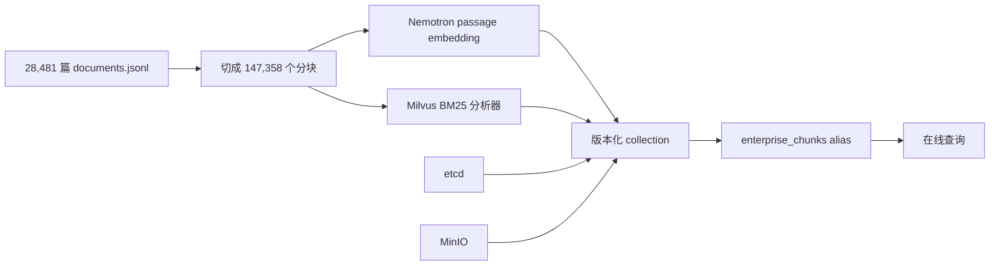

# P3 全量语料与 Milvus 执行验收报告

## 1. 执行结论

P3 已完成一轮公开代理语料的全量规模实验：TechQA 从 P2 的 1,000 篇扩展到 28,481 篇，关系从 307 条扩展到 7,600 条，生成 147,358 个分块并发布到 Milvus Standalone。索引能够分段写入、断点续传、通过 alias 原子发布，并在服务重启后直接挂载。

本轮仍未达到生产发布门槛。严格 Top-3 不同文档口径下，基础检索 Recall@3 为 65.00%，Top-1 为 62.50%，分别低于 85% 和 95% 门槛。Graph RAG、权限隔离、拒答和只读工具专项继续通过。

这里的 P3 是全量公开语料和持久化检索验证，不是真实企业部门试点。真实企业语料授权、源系统 ACL、撤权同步和业务 SLA 尚未验收。

## 2. 数据与索引规模

| 工件 | P2 | P3 当前 |
|---|---:|---:|
| TechQA 文档 | 1,000 | 28,481 |
| 分块 | 6,794 | 147,358 |
| `REFERENCES` 关系 | 307 | 7,600 |
| 固定金标题 | 180 | 180 |
| 向量后端 | 进程内存 | Milvus Standalone |
| 活动索引 | `p2-techqa-1000-v1` | `p3-techqa-28481-nemotron-1024-v3` |

金标仍保持 180 题，以便观察扩容导致的回归；它不是 28,481 篇语料的全面覆盖测试，因此所有小样本 100% 都必须结合置信区间解读。

## 3. Milvus 架构和发布方式



Milvus 每一版使用独立 collection。批量索引先创建未发布 collection，再按完整文档分段嵌入和写入；脚本可查询 `position == 0` 的文档 ID，跳过已经完成的文档。发布前会校验 Collection 文档 ID 集合与当前语料集合完全相等；已经由 alias 发布的版本禁止继续追加。所有文档写入并 flush 后，alias 才切换到候选 collection，中途失败不会污染在线版本。

当前脚本默认每段处理 800 篇。最后一段从 28,000 篇续传至 28,481 篇，写入 3,152 个分块后发布。全量构建采用多个可恢复分段，现有报告没有把各段耗时合并成一个可靠的总索引时长，因此不报告虚假的全量构建时间。

## 4. 检索实现

Milvus collection 同时存储：

- `dense`：Nemotron 1024 维、L2 归一化的稠密向量。
- `sparse`：由 Milvus BM25 function 从 `document_id + title + content` 生成。
- 字段化实验另有 `title_sparse` 和 `feature_sparse`，分别覆盖标题以及产品、组件、错误码和版本等显式特征。
- `status`、`tenant_id`、`allowed_roles`、兼容字段 `roles_text` 和用于过滤的十六进制 `roles_key`。
- 文档版本、锚点、业务分类、位置和正文。

原 P3 基线分别执行带 ACL filter 的 dense search 和 sparse search，在应用侧合并候选。字段化实验新增 Milvus 原生 `hybrid_search`：ACL/租户/candidate filter 放在每个 `AnnSearchRequest` 内，而不是放在会被静默忽略的顶层参数。两种模式都在返回侧重新校验状态、角色、租户和候选文档集合。

当前正式参数：

| 参数 | 值 |
|---|---:|
| 稠密向量权重 | 0.70 |
| 词法权重 | 0.30 |
| 返回文档数 | 3 |
| Milvus 候选扩展倍数 | 30 |
| Graph 种子数 | 2 |
| Graph 最大跳数 | 2 |
| Graph 路径上限 | 12 |

截断前先按 `document_id` 去重，只保留每份文档得分最高的分块，避免一篇长文档占满三条引用。

## 5. 权限实现

Milvus 的第一道过滤为：

```text
status == "active"
AND roles_key 命中当前角色十六进制 token 之一
AND tenant_id == 当前请求租户
```

角色名和文档 ID 只允许字母、数字、下划线、点、冒号和连字符，防止拼接过滤表达式时产生注入。角色写入 `roles_key` 前转为十六进制，避免 Milvus `LIKE` 把下划线解释为单字符通配符。检索返回后，系统再次核验 `status`、`allowed_roles`、`tenant_id` 和候选文档集合；若底层过滤失效，结果会退化为少召回而不是越权返回。

每个请求都把 `Principal.tenant_id` 传到检索层；空值、非法 claim 和与当前 store 租户不一致的请求会在查询前拒绝，Milvus 表达式和结果侧再各校验一次。当前仍是一实例一租户的部署模型，不等同于已经完成共享集群、多租户容量和运维验收。

## 6. 正式评测结果

配置：Nemotron 3 Embed 1B、1024 维、Milvus、dense weight 0.70、候选扩展 30、严格 Top-3 不同文档、无重排器、摘录式回答。

| 指标 | 结果 | 95% CI | n | 门槛 | 状态 |
|---|---:|:--:|---:|---:|---|
| 路由正确率 | 100.00% | 97.91-100.00% | 180 | 90% | 通过 |
| 基础检索 Recall@3 | 65.00% | 54.08-74.55% | 80 | 85% | 阻断 |
| 基础检索 Top-1 | 62.50% | 51.55-72.31% | 80 | 95% | 阻断 |
| Graph 联合 Recall@3 | 100.00% | 91.24-100.00% | 40 | 80% | 通过 |
| Graph 目标 Recall@3 | 100.00% | 91.24-100.00% | 40 | 85% | 通过 |
| Graph 路径正确率 | 100.00% | 91.24-100.00% | 40 | 95% | 通过 |
| Graph 相对 Hybrid 增益 | +32.50 个百分点 | - | 40 | +15 | 通过 |
| Graph ACL 隔离 | 100.00% | 83.89-100.00% | 20 | 100% | 通过 |
| 整体权限隔离 | 100.00% | 97.91-100.00% | 180 | 100% | 通过 |
| 拒答正确率 | 100.00% | 83.89-100.00% | 20 | 90% | 通过 |
| 工具答案正确率 | 100.00% | 83.89-100.00% | 20 | 85% | 通过 |
| 长度可容纳答案片段命中率 | 55.24% | 45.71-64.40% | 105 | 55% | 通过 |

其他观察指标：MRR@3 为 0.8167，nDCG@3 为 0.8187，P50 为 697.18 ms，P95 为 1,576.22 ms，评测挂载和初始化耗时 29.69 秒。这里的 29.69 秒不是全量向量构建时间。

## 7. 优化与诊断

严格按不同文档去重后，基础 Recall@3 从 63.75% 提升到 65.00%，Top-1 保持 62.50%。80 条基础检索题中，金标进入前 90 个候选的比例为 96.25%，进入前 20 个不同文档的比例为 91.25%，说明主要瓶颈是候选池内部的文档级排序，而不是权限过滤或完全找不到候选。

BGE 交叉编码器精排在现有数据上使 Recall@3 降至 46.25%、Top-1 降至 32.50%，没有采用。加权 RRF 的最佳对照可把 Recall@3 提升到 68.75%，但 Top-1 降到 51.25%，同样不适合作为默认策略。

下一步应优先：

1. 复核 80 条基础检索金标中的重复、近重复文档和单一来源假设。
2. 训练或选择 TechQA/企业域内的文档级排序模型，而不是继续使用通用 MS MARCO 重排器。
3. 把标题、标识符、正文和图邻域特征纳入可解释的 learning-to-rank 对照。
4. 扩充普通 RAG、权限和答案质量金标，缩窄当前宽置信区间。

## 8. 新增但未纳入正式基线的能力

- OpenAI-compatible 受引用约束生成：只接收编号证据，要求每个结论带 `[n]`，模型不可用时降级为摘录。
- LLM 重排器：可对授权候选做长上下文排序，尚未形成可发布的正式质量报告。
- 多格式准入：支持 Docling 优先解析 PDF、DOCX、PPTX、XLSX、HTML、Markdown 和文本，表格与正文分流，扫描 PDF 可路由 OCR；真实企业文件集和 OCR 引擎仍需验收。

P3 正式启动脚本明确使用摘录式回答和无重排器，因此不能用上述可选能力解释当前指标。

## 9. 阶段结论

P3 已证明持久化全量索引、断点续传、原子 alias 发布、ACL 下推和全量 Graph 数据可以在当前环境运行；尚未证明普通检索质量达到发布要求，也尚未完成真实企业部门、动态多租户、撤权时效、并发容量和灾难恢复验收。

在基础 Recall@3 和 Top-1 达标之前，该版本保持 `passed=false`，不得进入生产放行。
