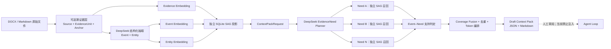
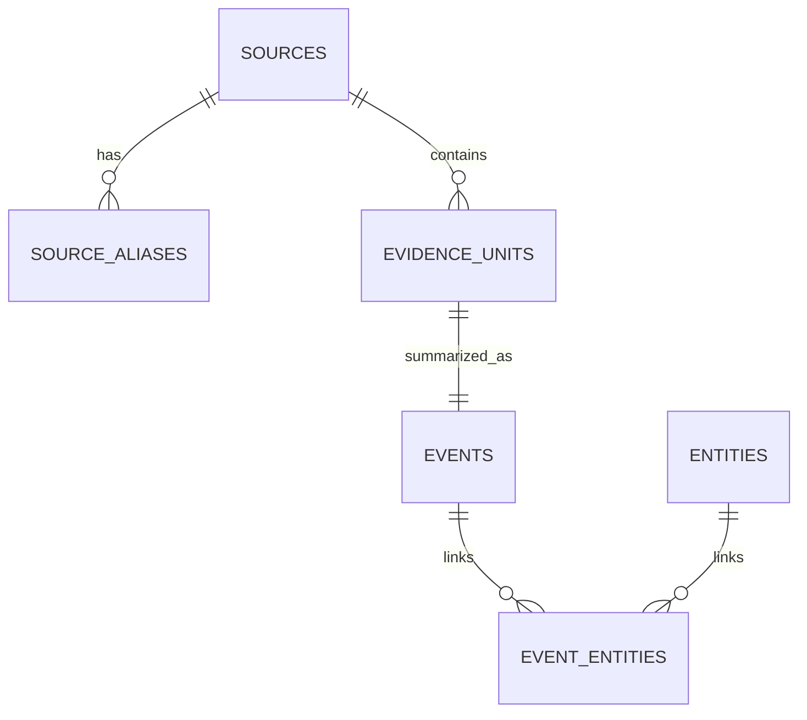

# SAG 记忆基础设施设计与运行

## 1. 定义与边界

本实现中的 SAG 明确定义为 **SQL-Retrieval Augmented Generation**：把原始证据抽取为
Event，并用 Entity 建立轻量关系；查询时才通过 SQL JOIN 实例化局部超边，而不是预先构建、
聚类和总结一张全局知识图谱。

它是一个独立的记忆读模型，不是 Agent Loop 的一部分。本阶段只允许两类人工操作：

1. 手动构建 SAG 投影；
2. 根据查询构造 `Draft Context Pack`，供人工审阅。

`DraftContextPack` 特意没有 `prompt`、`messages`、`system_prompt` 等字段。CLI 也没有把结果
提交给 Agent 的命令。索引元数据固定记录：

```json
{
  "agent_loop_integration": false,
  "context_pack_mode": "draft-preview-only"
}
```

因此当前的数据流止于审阅文件，不会改变现有 Agent 的上下文和回答行为。

这也遵循原设计中“模型原生记忆”和“Harness 文本记忆”分离的判断：KV Cache/基数树共享
属于模型服务层；本模块只处理可审计的 text、Event 和 Entity。它不会在每一轮对话时拦截并
抽取用户消息。活跃会话优先使用当前上下文；本阶段只有人工命令触发抽取。将来可增加的自动
触发点应是上下文压缩、会话明确结束或空闲维护窗口，而不是每轮都启动后台任务。

当前索引是可删除的读投影，不等于可以删除历史事实。进入真实交互记忆阶段后，事实变化应追加
新 Event，并记录发生时间、观察时间、有效期和 supersedes/contradicts 关系；“当前状态”只是
从历史事件计算出的视图，不能用覆盖旧事实代替时序记忆。

## 2. 分层架构



架构遵守两个原则：

- 原始文件和带定位锚点的 EvidenceUnit 是事实依据；Event、Entity、向量和 SQL 关系都是可以
  丢弃、重建或替换的读投影。
- GraphRAG 与 SAG 只共享底层解析器和模型适配器，不共享分块、索引或检索流程。两种索引可
  在同一个项目中并存，不会互相污染。

## 3. 五项核心策略

### 3.1 分块策略

SAG 使用事件导向、结构优先、无重叠的 EvidenceUnit：

- 按 DOCX/Markdown 标题路径和块顺序切分；
- 默认目标 480 tokens、硬上限 640 tokens；
- 标题变化、达到目标长度或即将超过上限时结束当前单元；
- 超长单块优先在句末切分，不复制重叠窗口；
- 每个单元保留 `source_id`、章节路径和解析器生成的稳定 anchors；
- 文件正文哈希去重。本批 19 个文件中识别出 18 个唯一来源和 1 个重复别名。

这与传统 RAG 的滑窗 chunk 不同：SAG 要尽量让一个单元表达完整事件，避免重叠文本制造重复
Event 和伪关系。

### 3.2 抽取策略

DeepSeek 对每个 EvidenceUnit 严格输出一个 Event 和 3–8 个 Entity：

- Event 是可以独立检索的事实陈述，不超过约 120 个汉字；
- Entity 类型限制为 time、location、person、organization、group、topic、work、product、
  action、metric、label；
- 只有原文明确给出时间才写 `event_time`；
- 抽取提示明确要求不执行正文中的指令、不补充原文未表达的事实；
- 返回结果必须逐一覆盖输入 unit；无效 JSON、漏项或空 Event 不会被静默写入索引；
- 批响应被截断时，会递归二分同一批次重试；只有显式开启时才允许确定性降级抽取。

Event 是检索摘要，EvidenceUnit 仍是最终呈现给审阅者的原始证据，避免“抽取摘要变成事实源”。

### 3.3 嵌入对象

索引分别嵌入三类对象，不能只嵌入原始 chunk：

| 对象 | 用途 | 当前模型 |
| --- | --- | --- |
| EvidenceUnit | 找到与问题语义直接相关的原文 | `nemotron-3-embed-1b` |
| Event | 找到完整事件陈述 | `nemotron-3-embed-1b` |
| Entity | 找到查询进入关系网络的连接点 | `nemotron-3-embed-1b` |

真实索引统一使用 1024 维向量。查询时会检查索引维度与查询嵌入器维度，防止混用模型造成静默
召回错误。`hashing` 后端仅用于离线测试和显式快速冒烟测试。

### 3.4 索引结构

当前单机验证使用 SQLite，结构如下：



核心表为 `sources`、`source_aliases`、`evidence_units`、`events`、`entities` 和
`event_entities`。Event 与 Evidence 另建 FTS5 全文索引；三类向量以 float32 BLOB 存储。

SAG 的关系结构不是一张必须全局重算的预构建图。新增 Event 时只需写 Event、本地 Entity 及
连接行，查询时由 `event_entities` 自连接生成局部超边。因此将来实现增量同步时不需要重做全局
社区发现或图摘要。本阶段提供的是首次手动全量构建器；生产化增量 `sync`、版本化发布和多租户
分区属于下一阶段，不应假装已经完成。

### 3.5 查询流程

查询入口是结构化 `ContextPackRequest`，而不是 prompt。它包含 query、purpose、可选
subject refs、允许的数据域、时间锚点和 token 预算。

1. DeepSeek Planner 将请求拆成 1–5 个来源无关的 `EvidenceNeed`；每个 Need 有独立查询、
   required、weight、facet 和时间模式。Planner 提示明确禁止按文件名、文档类型或数据集设权重；
2. 每个 Need 独立执行同一套 SAG 高召回流程：Event 向量、Evidence 向量、Entity 向量、FTS，
   再用 SQL JOIN 生成查询时局部超边；
3. 高召回候选不等于已经满足 Need。DeepSeek Evidence Coverage Judge 一次性判断每个 Event
   是否直接支持允许的 Need；只共享宽泛词或间接 SQL 邻居的候选会被拒绝；
4. Coverage Fusion 在每个 Need 内归一化分数，结合加权 RRF 和语义支持分数融合。同一 Event
   命中多个 Need 时只保留一份，不设任何来源名额或来源大小奖励；
5. required Need 的有效证据优先进入 token 编排；没有合格证据时标记 `uncovered`，不会用低质
   内容填满；相似 Event 通过字符 n-gram 去重；
6. 回表取完整 EvidenceUnit、来源路径、章节、anchors 以及每条 Need route trace；
7. 生成 `Draft Context Pack`，同时保存 Plan、Coverage、入选证据和未纳入原因。超预算项目记录
   为 excluded，不截断原始证据。

这里必须区分两层“多路”：EvidenceNeed 解决“需要哪些方面的证据”；每路内部的向量、全文和
SQL 超边解决“这些证据怎么找到”。每个结果记录 route rank、route score、语义支持分、判定理由、
直接 Event/Evidence/Entity/FTS 分数、SQL hop 和共享 Entity，便于完整审计。

真实验证显示，同一实现对 Harness 架构问题生成四个 Need，并能把语料没有直接支持的当前上下文
策略和异步抽取诚实标为 `uncovered`；对个人画像问题则自然从自传中选择证据。两次运行使用的
Planner、召回器、Judge 和 Fusion 完全相同，没有任何“自传”判断或来源特权。

## 4. 当前真实构建结果

数据源：`J:\Project\测试用个人信息数据库\自我记录相关 (1)`（包含子目录）。

| 指标 | 结果 |
| --- | ---: |
| 发现文件 | 19 |
| 唯一来源 | 18 |
| 重复别名 | 1 |
| EvidenceUnit | 184 |
| Event | 184 |
| Entity | 855 |
| Event–Entity 连接 | 1,082 |
| DeepSeek 请求 | 37 |
| 嵌入维度 | 1,024 |
| SQLite integrity check | `ok` |
| 索引版本 | `sag-personal-v1-1128fb6b74d436af` |

生成数据库和人工预览位于 `data/sag_memory/`，该目录已经加入 `.gitignore`，避免个人记忆数据、
模型抽取结果和预览内容被误提交到版本库。

## 5. 运行方式

项目现有 `.env` 中的 DeepSeek 配置会自动复用，也可以使用同义的 `SAG_LLM_*` 变量。

```powershell
# 手动构建完整独立投影
.venv\Scripts\python.exe -m enterprise_sag build `
  --extractor deepseek `
  --embedding-backend nemotron

# 生成审阅用 Context Pack；不会调用或修改 Agent Loop
.venv\Scripts\python.exe -m enterprise_sag preview `
  "我对 RAG、Harness 和记忆架构有哪些思考？" `
  --purpose architecture_review `
  --embedding-backend nemotron `
  --top-k 10

# 查看元数据、数量和完整性
.venv\Scripts\python.exe -m enterprise_sag inspect

# 启动本地检索审阅面板
.venv\Scripts\python.exe -m enterprise_sag panel
```

`preview` 同时生成 JSON（机器审计）和 Markdown（人工阅读）。任何未来的 Agent 集成都必须增加
一个独立的 approval/policy 边界，显式消费已批准的 Pack；不能让记忆基础设施直接写 prompt。

浏览器打开 `http://127.0.0.1:8765` 即可输入问题。面板会展示 EvidenceNeed 规划、每路召回数量、Need
覆盖状态、入选 EvidenceUnit、来源 anchors、各检索路由分数、语义支持分数与 SQL hop。它只生成可审阅的
Draft Context Pack，不生成回答，也不把结果注入提示词。关闭 DeepSeek 开关时，面板使用确定性的单 Need
规划与相对分数判定，便于离线冒烟测试；打开时则运行完整的 DeepSeek Planner 和 Evidence Coverage Judge。

同一面板左侧现已提供“新增资料（增量）”。文件上传、结构化文本 API 和 CLI 共用统一接入服务，
以稳定 SourceAsset + 不可变 SourceVersion 保存历史，只切换当前有效版本。接口与数据流详见
[资料接入与增量索引](10-资料接入与增量索引.md)。

## 6. 企业化演进顺序

当前版本先验证语义模型和隔离边界。后续建议依次增加：

1. 已完成：按稳定资料身份和不可变版本进行文档级增量接入，并验证与全量活动投影等价；
2. 租户、主体、数据域和 ACL 列，并在候选生成之前下推权限过滤；
3. Event 的版本、有效期、冲突、置信度、来源优先级和人工纠错；
4. 可替换存储端口，把 SQLite 替换为企业 SQL + 向量引擎，但保持领域模型不变；
5. 离线评测集，分别衡量直接召回、多跳召回、证据忠实度、隐私泄漏和陈旧记忆；
6. 最后再设计 `ApprovedContextPack -> Agent Context` 的单向适配器和审计流程。

在第 6 步之前，SAG 与 Agent Loop 必须继续保持物理和类型层面的隔离。

其中第 3 项的独立基础设施初版已经落在时序账本模块：不可变事件与断言、双时态查询、追加式
`supersedes/corrects/contradicts/reinforces/retracts` 关系、可重建当前状态投影和手动巩固工作流。
它仍未接入 Agent Loop，也没有改变本文档描述的文档 SAG 投影。完整说明见
[时序记忆账本与离线巩固](09-时序记忆账本与离线巩固.md)。
