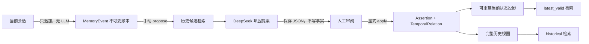

# 时序记忆账本与离线巩固

## 1. 实现边界

本模块解决“事实会变化，但历史不能丢失”的问题。它与 Agent Loop 保持隔离：活跃交互路径只允许
向不可变事件账本追加一条记录，不执行检索、抽取或 LLM 调用。事实抽取、相关历史召回、关系判定
和读投影更新，只能通过手动命令或未来的会话结束/空闲维护调度器触发。

当前数据流为：



不存在 `Memory -> Agent Prompt` 的写入路径。巩固模型只能生成受约束的 Proposal，不能直接操作数据库。

## 2. 不可变层与读投影

以下表由 SQLite trigger 强制禁止 `UPDATE` 和 `DELETE`：

- `memory_events`：用户或外部系统实际提供的原始事件；
- `temporal_assertions`：从事件中抽出的独立事实断言；
- `assertion_relations`：断言之间追加的时序关系；
- `consolidation_runs`：应用过的提案和完整审计内容；
- `assertion_usage_events`：检索选择、成功使用或拒绝反馈。

以下对象是可删除、可重建的读投影，不是真相来源：

- `current_assertion_projection`：当前时点每条断言的生命周期；
- `assertion_embedding_projection`：可随嵌入模型升级而重算的向量；
- `assertion_fts`：全文检索投影。

“不删除历史”只约束不可变层；投影必须允许重建，否则模型升级、纠错算法升级和灾难恢复都会变得困难。

## 3. 双时态

系统区分四个时间概念：

| 字段 | 含义 |
| --- | --- |
| `occurred_at` | 原始事件在现实中发生的时间，可以为空 |
| `observed_at` | 系统获知原始事件的时间 |
| `valid_from / effective_at` | 事实或关系在现实中开始生效的时间 |
| `recorded_at` | 事实或关系真正写入系统的事务时间 |

查询同时接受：

- `valid_at`：想知道现实世界某个时点什么事实有效；
- `known_at`：想还原系统在某个时点已经知道什么。

因此，用户今天补充“其实上周就已经修改规则”，可以令 `valid_from=上周`、`recorded_at=今天`。
当前视图会按现实生效时间重新计算；使用旧 `known_at` 查询时，仍能还原系统当时尚不知道这次修改。

## 4. 事实关系与生命周期

当前支持五种追加关系：

| 关系 | 对旧事实的影响 |
| --- | --- |
| `supersedes` | 新状态替代旧状态，旧事实变为 `superseded` |
| `corrects` | 新事实指出旧认知错误，旧事实变为 `corrected` |
| `retracts` | 明确撤回旧事实，旧事实变为 `retracted` |
| `contradicts` | 两者冲突但无法确定谁失效，旧事实变为 `contested` |
| `reinforces` | 再次确认，不改变旧事实有效性 |

`contradicts` 不会自动删除或压制事实。比较偏好、范围变化和例外条件也不应被误判为替代；DeepSeek
提示词要求保守判定，而数据库服务会验证关系只能指向本次提案审阅过的同主体候选。

## 5. 有效性优先检索

`latest_valid` 查询先执行硬过滤，只允许 `active` 和 `contested` 断言进入排序。`historical` 查询才会
检索在目标时间可见的失效历史。排序分数由以下信号组成：

```text
60% 语义向量相关性
15% 全文相关性
10% 事实置信度
 8% 关键性
 5% 使用反馈与事实重复确认强化
 2% 时间新近度
```

调用次数、成功使用次数、拒绝反馈和 `reinforces` 次数只影响通过有效性门控后的排序。即使旧事实过去成功使用一万次，
一旦被 `supersedes`，它也不能出现在 `latest_valid` 结果中。

## 6. 手动运行

```powershell
# 初始化独立时序库
.venv\Scripts\python.exe -m enterprise_sag memory init

# 活跃路径：只追加，不进行抽取或检索
.venv\Scripts\python.exe -m enterprise_sag memory append `
  "以后处理飞书文章时，先导出 Word，再按平台修改格式。" `
  --subject-id "user:demo" `
  --occurred-at "2026-08-07T09:00:00+08:00"

# 查看等待离线巩固的事件
.venv\Scripts\python.exe -m enterprise_sag memory pending

# DeepSeek 只生成 JSON 提案，不会写入事实层
.venv\Scripts\python.exe -m enterprise_sag memory propose <EVENT_ID>

# 人工检查 JSON 后显式应用
.venv\Scripts\python.exe -m enterprise_sag memory apply <PROPOSAL_JSON>

# 查询当前有效状态
.venv\Scripts\python.exe -m enterprise_sag memory query `
  "飞书文章应该使用什么发布格式？" `
  --subject-id "user:demo" `
  --mode latest_valid

# 查询某个历史时点
.venv\Scripts\python.exe -m enterprise_sag memory query `
  "当时的飞书文章发布规则是什么？" `
  --subject-id "user:demo" `
  --mode historical `
  --valid-at "2026-08-07T12:00:00+08:00"
```

默认数据库为 `data/sag_memory/temporal_memory.sqlite`，提案默认保存在
`data/sag_memory/temporal_proposals/`。该目录已被 `.gitignore` 排除。

## 7. 尚未接入的部分

当前完成的是独立基础设施和手动工作流，以下内容仍然故意不接入：

1. Agent Loop 自动写入；
2. 上下文压缩、会话结束或空闲窗口的自动调度器；
3. Proposal 的企业审批 UI；
4. 多租户、主体 ACL 和 namespace 下推过滤；
5. `Approved Context Pack -> Agent Context` 适配器。

这些能力必须在账本、权限、审计和离线评测稳定之后逐层增加，不能通过在 Agent Prompt 中直接拼接
一段“最新记忆”来绕过时序基础设施。
