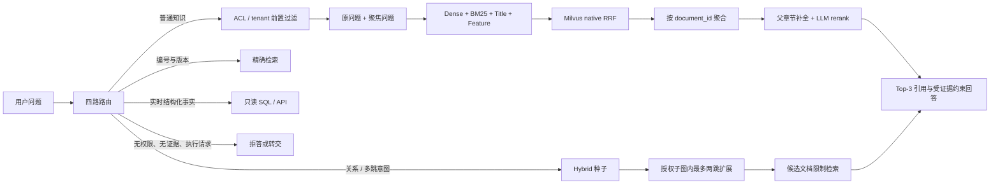

# Hybrid RAG 与 GraphRAG 演进复盘

> 截至 2026-08-15。本报告按实际工程时间线复盘系统如何从小规模 Hybrid RAG 原型，演进为全量 Milvus Hybrid RAG 和 ACL-first GraphRAG；同时记录指标变化、失败实验、根因、解决方案及仍未完成的工作。

> 术语、分块、父块重排、多路召回、RRF、Graph 指标、索引版本和评测题目口径的逐项说明，见[技术原理问答](12-Hybrid与GraphRAG技术原理问答.md)。

## 1. 执行摘要

这条演进路线可以概括为四步：

1. 先建立可信边界：路由、ACL、引用、拒答、只读工具和固定 Gold，而不是先追求一个高 Recall 数字。
2. 再把 Hybrid RAG 从“关键词加向量”升级为字段化、多查询、文档级聚合、可审计重排和结构化父子分块。
3. GraphRAG 只使用正文中可验证的显式引用边，在授权子图内扩展，并与向量索引成对版本化。
4. 当指标出现反常变化时，先检查候选池、排序输入、Gold 和实验公平性，再决定是否改算法。

最终得到的不是一个在所有问题上都最优的单一配置，而是清晰的适用边界：

- 对普通单文档问答，当前最佳历史质量组合是 `structured 256/48 + gpt-5.6-sol replace`，在原 55 题旧 Gold 上达到 Recall@3 `49/55（89.09%）`、Top-1 `37/55（67.27%）`。
- 如果更重视 DeepSeek 的 Top-1 和抽取式答案质量，旧 `900/100` 字符分块仍更合适，公平复测为 Recall@3 `45/55`、Top-1 `39/55`。
- 对专门设计的关系/多跳问题，GraphRAG 在 P2/P3 的 40 题专项集上保持目标召回、联合召回和路径准确率 `100%`。
- 对同一批普通 RAG 问题强制启用 GraphRAG，DeepSeek 从 `47/55` 降到 `43/55`，Luna 从 `48/55` 降到 `42/55`，且没有救回任何一道 Hybrid miss。因此 GraphRAG 应由路由器选择性启用，而不是替代 Hybrid RAG。
- 当前仍不是生产放行状态。扩充后的 240 题 Gold（235 题计分）尚未完成全量新策略复测，Top-1、外部重排延迟、图候选融合和真实企业数据治理仍是未完成项。

## 2. 当前架构全貌

Hybrid 是主召回和排序底座；Graph 是条件式增强层，而不是另一套绕开 Hybrid 的检索系统。Graph 的种子仍来自 Hybrid，图目标文档仍要经过 ACL 和候选限制检索。

## 3. 时间线总览

| 时间 | 阶段 | 核心变化 | 代表性结果 | 当时结论 |
|---|---|---|---|---|
| 2026-07-17 至 07-18 | P1 小规模 Hybrid | 200 文档、BM25 + Nemotron、四路路由、ACL-first | Recall@3 96.25%，Top-1 87.50% | 召回已高，但 Top-1 未过 95% 门槛 |
| 2026-07-18 至 07-27 | P2 GraphRAG | 1,000 文档、307 条显式引用、两跳授权子图 | Graph 目标/联合/路径 100%，相对 Hybrid +82.5 pp | Graph 专项成立，基础排序仍未解决 |
| 2026-07-29 至 08-07 | P3 全量 Milvus | 28,481 文档、147,358 chunks、7,600 边、持久化版本发布 | 基础 Recall@3 65.00%，Top-1 62.50%；Graph 专项仍 100% | 规模放大后主要瓶颈变成候选内排序 |
| 2026-08-04 至 08-05 | 检索与评测修复 | 共用组件、文档聚合、特征加权、证据摘录、hard negatives | 普通 RAG Recall@3 63.64% → 69.09% | 找到更多正确文档，但第一名不稳定 |
| 2026-08-05 | 首轮 LLM 重排 | NowCoding Top-20 文档重排 | Recall@3 69.09% → 83.64%，Top-1 58.18% → 67.27% | 排序有效，但 P95 约 13 秒且有波动 |
| 2026-08-06 至 08-07 | 字段化 Hybrid + DeepSeek | 原问题/改写并行、title/feature BM25、native RRF、严格 record/replay | DeepSeek replace 46/55、Top-1 40/55；weighted RRF 42/55、28/55 | 弱基础名次不宜用 0.5 权重拉回 |
| 2026-08-07 | 结构化父子分块 | 384/64 子块、1,200-token 父块、章节识别 | 原生 Top-1 24/55 → 26/55，但 DeepSeek 初测降至 44/55、36/55 | 分块改善候选，不等于适配现有重排输入 |
| 2026-08-07 至 08-08 | 父块重排与公平候选池 | 父块在重排前补全；Top-20 自适应 distinct-doc recall | structured DeepSeek Recall 44/55 → 46/55 | 修复了抽象边界错误，但 Top-1 仍不如旧块 |
| 2026-08-08 至 08-09 | 分块 × 模型公平消融 | 900/100、384/64、320/48、256/48；DeepSeek/Luna/Sol | 256/48 + Sol 达到 49/55、Top-1 37/55 | 分块最优解与重排模型强相关 |
| 2026-08-09 | Gold 治理与扩充 | 180 → 240 题；证据组、纠错、排除和逐题审计 | 235 题计分；5 排除、4 纠正、2 扩展、1 ambiguous | Gold 是评测系统的一部分，不能把标注噪声归咎于检索 |
| 2026-08-09 | 普通题强制 Graph 公平评测 | 锁定 55 ID、冻结基础重排、强制 graph | DeepSeek 47→43；Luna 48→42；0 rescue | Graph 不应无条件占用普通问题 Top-3 |
| 2026-08-10 | 智能知识图谱增强尝试 | Terra 审核结构、实体、别名、规则边和文档级验证 | v4 仅完成 2,454 文档且规则审核覆盖 51.038% | 部分图不可上线；v5 加 100% 完整性审计后等待额度恢复 |

不同阶段的数据规模、题目范围和 Gold SHA 不完全相同。上表用于描述工程演进，不能把所有百分比连成一条严格的单变量提升曲线。

## 4. 详细演进过程

### 4.1 2026-07-17：P1 建立可运行的 Hybrid RAG 闭环

第一阶段没有直接引入图数据库或复杂 Agent，而是先划清数据和执行边界：

- 稳定企业知识进入 RAG；编号和版本走精确检索；实时结构化数据只走只读 SQL；无证据、无权限和执行型请求拒答或转交。
- BM25 与 Nemotron dense embedding 做混合召回，ACL 在关键词和向量评分前执行。
- 回答必须带来源引用，系统同时记录审计与反馈。
- 用 120 题固定 Gold 覆盖普通 RAG、精确检索、工具、越权和无证据场景。

200 文档下，Nemotron 1024 维达到 Recall@3 `96.25%`、Top-1 `87.50%`。2048 维没有质量收益；BGE-M3 Top-1 更低；通用 MiniLM 重排把 Top-1 进一步降到 `82.50%`。因此当时选择 Nemotron 1024、无重排器，并把 Top-1 作为明确阻断项，而没有通过放宽门槛掩盖问题。

这一阶段得到的第一个关键经验是：高 Recall 不代表排序已解决；嵌入维度更大或加一个通用 reranker 也不必然更好。

证据：[P1 执行与验收报告](04-P1执行与验收报告.md)。

### 4.2 2026-07-18 至 07-27：在 P1 上增加 ACL-first GraphRAG

P2 把语料扩大到 1,000 篇，并从正文中明确出现的 `swg...` 引用建立 307 条 `REFERENCES` 边。选择显式引用而非自由实体联想，是为了让图路径本身可以被审计，避免把模型猜测当成事实关系。

Graph 查询流程为：

1. Hybrid 检索得到种子文档。
2. 先计算当前角色可见的文档 ID 集合。
3. 只在授权子图内最多扩展两跳。
4. 对图目标文档再次执行带 ACL 和 candidate filter 的检索。
5. 返回种子、图证据及完整路径。

同时实现了检索索引和关系图的同版本发布与成对回滚。图遍历前就裁剪未授权节点；不可见文档不会进入遍历队列、路径、引用或回答。

40 道专门的跨文档题上，Graph 联合 Recall、目标 Recall、路径准确率均为 `100%`，纯 Hybrid 目标 Recall 只有 `17.5%`，Graph 增益 `+82.5 pp`。但普通 P1 Top-1 在 1,000 文档下仍只有 `86.25%`。这证明 GraphRAG 能解决关系型问题，却不会自动修复普通语义排序。

证据：[P2 Graph RAG 执行与验收报告](05-P2执行与验收报告.md)、[Graph 检索实现](../src/enterprise_rag/graph_retrieval.py)、[版本化图实现](../src/enterprise_rag/graph.py)。

### 4.3 2026-07-29 至 08-07：全量语料放大，Hybrid 的真实瓶颈暴露

P3 将 TechQA 扩大到 28,481 篇，建立 147,358 个旧字符 chunks 和 7,600 条显式引用边，并把进程内存检索迁移到 Milvus Standalone。

这一阶段解决的首先是可运行性和一致性：

- 每个索引版本使用独立 collection，通过 alias 原子切换。
- 按完整文档分段写入并支持断点续传。
- 禁止向已发布版本继续 append。
- 发布前比较完整文档 ID 集，而不只检查行数或非空。
- dense、BM25、状态、tenant、角色和版本元数据保存在同一检索后端。

规模放大后，基础 Recall@3 从小语料的 95% 左右降到 `65.00%`，Top-1 降到 `62.50%`。Graph 专项的目标、联合和路径仍为 `100%`，相对 Hybrid 增益降为 `+32.5 pp`，原因是全量语料下 Hybrid 本身更容易找到部分目标。

诊断发现，正确文档进入前 90 候选的比例为 `96.25%`，进入前 20 个不同文档的比例为 `91.25%`。因此主要问题不是 ACL 把文档过滤掉，也不是向量库完全找不到文档，而是大量相似 IBM 技术文档进入候选后，文档级排序无法把正确来源稳定推到 Top-3/Top-1。

证据：[P3 全量语料与 Milvus 报告](07-P3执行与验收报告.md)、[Milvus 存储实现](../src/enterprise_rag/vector_store.py)。

### 4.4 2026-08-04 至 08-05：先修评测和候选表示，再尝试 LLM 重排

在引入更强模型前，先修复了几处系统性问题：

- 服务端与评测脚本改为共用组件 factory，消除“离线测的是一套、线上跑的是另一套”的配置漂移。
- chunk 候选先按 `document_id` 聚合，每个文档只提交若干问题相关片段，避免长文档的相邻块占满候选池。
- 产品、组件、错误码和版本只做有界正向特征，不做可能误杀的硬过滤。
- 摘录器在词覆盖相同时优先更短、更聚焦的句子，避免 URL 和“参见文档”长句占满回答预算。
- 输出 Top-20 hard-negative 人工复核队列，不把未经审查的非 Gold 文档直接当训练负例。
- 普通 RAG 与 exact search 分开报告，增加 Wilson 置信区间和逐题结果。

在无 reranker 的相同配置下，普通 RAG Recall@3 从 `63.64%` 提升到 `69.09%`，但 Top-1 从 `60.00%` 降到 `58.18%`。这说明特征增强让更多正确文档进入前三，却没有稳定解决第一名。

随后对 55 道普通 RAG 题使用 NowCoding 做 Top-20 文档重排：Recall@3 从 `38/55` 提升到 `46/55（83.64%）`，Top-1 从 `32/55` 提升到 `37/55（67.27%）`。代价是 P50/P95 增至约 `8.45/13.06 秒`，并出现温度为 0 仍有逐题排序波动的问题。

这里形成了第二个关键经验：当 Gold 已在 Top-20 时，领域能力更强的 LLM reranker 能显著改善排序；但候选未进入池、托管端点不确定性、延迟和答案摘录仍是独立问题。

证据：[检索修复报告](../reports/p3-repair-analysis.zh-CN.md)、[NowCoding 重排归因](../reports/p3-nowcoding-reranker-analysis.zh-CN.md)。

### 4.5 2026-08-06 至 08-07：字段化 Hybrid、原生 RRF 与可复现重排

针对长问题中日志和通用错误词稀释核心意图的问题，Hybrid 召回升级为：

- 保留完整原问题，同时生成“产品 + 组件 + 错误码/版本 + 核心动作”的确定性聚焦查询。
- dense、综合 BM25、标题 BM25、显式 feature BM25 多分支召回。
- 使用 Milvus native `hybrid_search` 和 RRF，减少客户端多次往返。
- 每个 `AnnSearchRequest` 都携带相同的 tenant、状态和角色 filter；结果返回后再次检查 ACL、tenant 和 candidate IDs。

原生 Hybrid 与应用侧 separate 合并的 Recall@3 都是 `37/55`；Top-1 从 `25/55` 变为 `24/55`，但 P50 从 `1,355.66 ms` 降到 `797.46 ms`，P95 从 `2,552.57 ms` 降到 `1,263.45 ms`。因此 native Hybrid 的确定收益是执行效率，而不是排序质量。

DeepSeek `replace` 把 native 结果提升到 Recall@3 `46/55`、Top-1 `40/55`。同一批模型判断采用 `weighted_rrf` 后只有 `42/55`、`28/55`。根因是基础名次本身较弱，0.5 融合权重把 DeepSeek 已排对的文档重新拉低。当前采用纯 `replace`，但保留继续扫描更高模型权重的可能性。

为了让 A/B 可复现，重排器增加了 record/replay 缓存：缓存键覆盖模型、提示词、问题、候选内容和顺序；报告保存 judgement digest、cache hit、实际 HTTP 次数和降级次数；外部失败或解析失败立即中止，不再静默产生伪结果。后续更严格的候选池公平复测将旧字符 DeepSeek 最终修正为 `45/55`、Top-1 `39/55`，所以早期 `46/55、40/55` 只保留为阶段结果。

这一阶段还修复了三类安全问题：Milvus 顶层 Hybrid filter 可能被静默忽略，改为每个 ANN 分支都带 filter；角色下划线在 `LIKE` 中会成为通配符，改为十六进制 `roles_key`；缺失 tenant 不再回退到默认值，并在 API、JWT、检索表达式和结果侧多层校验。

证据：[字段化检索与 DeepSeek 报告](../reports/p3-fielded-repair-analysis.zh-CN.md)、[重排实现](../src/enterprise_rag/reranking.py)。

### 4.6 2026-08-07：结构化父子分块暴露“召回输入”和“重排输入”不一致

旧索引使用 `900/100` 字符窗口。为了保持 FAQ、CAUSE、ANSWER、RESOLVING THE PROBLEM 等技术文档章节完整，新增 `structured-parent-child-v1`：

- 384-token 子块、64-token overlap，用于 dense/BM25 召回。
- 最大 1,200-token 父章节，用于回答证据。
- 识别 Markdown、编号标题和 TechQA 结构标签。
- 独立 alias 建索引，不直接替换旧生产实验索引。

无重排时，结构化分块的 Top-1 从 `24/55` 提升到 `26/55`，短答案命中从 `27.5%` 提升到 `32.5%`，Gold Top-20 从 `51/55` 提升到 `52/55`；但 Recall@3 从 `37/55` 降到 `36/55`。

接入 DeepSeek 后，结构化分块初测只有 Recall@3 `44/55`、Top-1 `36/55`，低于旧块的 `46/55、40/55`。根因不是父子分块本身无效，而是父块只在最终 Top-3 排完后补取，重排器实际看到的仍是被字符预算截断的子块。

修复方式不是给个别题加特例，而是调整抽象边界：在文档候选聚合后、rerank 前按 `parent_id` 批量补全父章节，再让模型比较同一层级的文档证据。修复后 structured + DeepSeek Recall 从 `44/55` 回到 `46/55`，但 Top-1 为 `35/55`，仍不如旧字符块。

这说明分块策略必须和 reranker 的输入契约一起设计；“召回更好”不等于“最终排序更好”。

证据：[结构化分块报告](../reports/p3-structured-chunk-analysis.zh-CN.md)、[结构化 DeepSeek 评测](../reports/p3-structured-deepseek-evaluation.zh-CN.md)。

### 4.7 2026-08-08 至 08-09：建立真正公平的分块 × 模型消融

早期 Top-3 查询只从较小 chunk 池中取候选，无法公平声称 reranker 比较了 20 个文档。随后建立统一候选契约：

- 每题必须形成 20 个不同 `document_id`。
- 初始 chunk 预算为 `20 × search_multiplier(30) = 600`。
- 不足 20 个不同文档时自适应倍增，最多 4,096 chunks；仍不足则直接失败。
- 所有分块、模型和策略使用相同 Top-20 文档级输入，预选完成前不调用外部模型。

原生检索结果为：

| 分块 | Chunks | Recall@20 | Recall@3 | Top-1 |
|---|---:|---:|---:|---:|
| 旧字符 900/100 | 147,358 | 51/55 | 37/55 | 24/55 |
| structured 384/64 | 82,228 | 52/55 | 36/55 | 26/55 |
| structured 320/48 | 97,288 | 51/55 | 36/55 | 25/55 |
| structured 256/48 | 119,467 | 52/55 | 39/55 | 23/55 |

重排后的公平结果为：

| 模型 | 旧字符 900/100 | structured 384/64 | structured 256/48 | 阶段选择 |
|---|---|---|---|---|
| DeepSeek | Recall 45/55；Top-1 39/55 | 46/55；33/55 | 46/55；32/55 | Top-1/答案优先选旧字符 |
| GPT-5.6-Luna | 44/55；36/55 | 46/55；34/55 | 47/55；32/55 | Recall 优先选 256/48 |
| GPT-5.6-Sol | 46/55；38/55 | 49/55；35/55 | 49/55；37/55 | 综合质量选 256/48 |

`256/48 + Sol` 同时取得最高 Recall@3、MRR `0.7758` 和 nDCG `0.8056`，Top-1 只比旧字符 + Sol 少 1 题，因此成为当前历史 55 题上的最终质量推荐。DeepSeek 下旧字符仍有明显 Top-1 和短答案优势，说明不存在脱离 reranker 的“绝对最佳分块”。

运行中多次遇到 NowCoding TLS EOF、本地 Milvus 停止等外部故障。严格 record 缓存使任务可以从已验证结果续跑，只补剩余调用；最终缓存必须覆盖 55 个唯一键、每行 20 个候选、零降级。混合 cache/API 的延迟不参与横向比较。Sol 的完整外部调用 P50/P95 约为 `20.18/35.36 秒`，质量提升伴随明显线上成本。

证据：[分块自适应消融](../reports/p3-chunk-ablation-adaptive20.zh-CN.md)、[旧字符公平复测与三模型对照](../reports/p3-chunk-ablation-legacy-fair.zh-CN.md)。

### 4.8 2026-08-09：Gold 从“单一 source ID”演进为可治理评测资产

检索失败审计发现，部分所谓 miss 实际返回了等价公告、更新版本或更直接的文档；另一些原 Gold 与题目根本不匹配。若不先治理 Gold，继续优化会把系统推向错误目标。

因此实施了两步：

1. 从 180 题扩充到 240 题，新增加 60 道普通 RAG，engineering、operations、restricted 各 20 道；另有 11 个弱候选因答案残缺、只有关键词重合或无法建立直接证据链而被淘汰。
2. 对 140 道基础检索题逐题复核，最终 135 道计分：5 道无可靠证据的错配题保留但排除计分，4 道纠正答案或来源，2 道扩充等价来源，1 道标记 ambiguous，其余 verified。

扩充后总计 240 题、235 题计分，其中普通 RAG 120 题。报告开始记录 Gold SHA、score status、review status 和排除原因，防止不同 Gold 版本的数字被直接横比。

Gold 治理没有替代排序优化：很多正确 Gold 已在 Top-20 却没进 Top-3，仍是真实排序问题。但它消除了“召回了等价公告却按错题处理”和“追逐错误来源”的评测债务。

证据：[Gold 扩充审计](../reports/p3-gold-expansion-audit.md)、[Gold 逐题复核](../reports/p3-gold-curation.zh-CN.md)。

### 4.9 2026-08-09：在普通问题上强制 GraphRAG，明确 Graph 的适用边界

为了回答“GraphRAG 是否应全部开启”，使用同一批原 55 个普通 RAG ID、同一 `structured 256/48` 索引，只测试 DeepSeek 与 Luna，并强制 `retrieval_mode=graph`。

第一轮运行暴露了两个实验和实现问题：

- 两次独立 LLM 调用会造成 Top-1 漂移，不能把模型随机波动归因于 Graph。解决方式是用原 Hybrid 的 55 条重排缓存作为种子，只对新增图候选调用模型。
- Graph 候选 allow-list 最多只有 12 个文档，自适应召回却按更大的请求 Top-K 不断扩张，最终让 Milvus `offset + limit` 超过 16,384。根因是召回预算没有感知有限候选集合。解决方式是在 candidate-restricted search 中把 distinct-document target 和 rerank 数量上限裁到 allow-list 大小，并对 Milvus 结果窗口设置 16,384 的硬上限。

Gold 在另一个工作流中同步更新也导致旧 Hybrid 与新 Graph 的 SHA 不同。为保持公平，最终重新用当前 Gold 校准 Hybrid，锁定问题 ID、Gold SHA、候选判断和分块索引。

最终结果：

| 重排模型 | Hybrid Recall@3 / Top-1 | GraphRAG Recall@3 / Top-1 | Graph 变化 |
|---|---:|---:|---:|
| DeepSeek | 47/55 / 32/55 | 43/55 / 32/55 | Recall -4，0 rescue |
| Luna | 48/55 / 33/55 | 42/55 / 33/55 | Recall -6，0 rescue |

根因在当前融合方式：结果按 `[base top1, graph neighbors, base remainder]` 组装。它保护第一名，因此 Top-1 不变；但图邻居会固定占用后续位置，把原本排第 2/3 的正确普通文档挤出 Top-3。

这不是“GraphRAG 无效”的结论。专门的 40 道图问题仍证明显式引用扩展有效；失败的是把关系增强无条件应用于单文档问题。当前策略是保留 `auto/hybrid/graph` 三种模式，由 router 只对关系和多跳意图启用 Graph。下一步应把 base 和 graph 候选统一融合/重排，而不是固定插槽。

未命中 Gold 的人工审计还发现，15 题并集中没有明显错误 Gold，但 DeepSeek 有 5 个、Luna 有 6 个 miss 实际拿到了可回答问题的等价 IBM 文档。这进一步支持增加“可接受来源组/同簇语义相关”辅助指标，同时保留 exact-ID 作为严格指标。

证据：[GraphRAG 公平评测与 Gold 审计](../reports/p3-graph-rag55-deepseek-luna-fair.zh-CN.md)、[Graph 选择逻辑](../src/enterprise_rag/service.py)。

### 4.10 2026-08-10：智能知识图谱构建未因部分成功而提前上线

当前在线 Graph 使用 7,600 条正文显式 `REFERENCES` 边，可靠但关系类型有限。随后尝试用 GPT-5.6-Terra 审核文档结构、实体、别名、确定性候选边、模型新增边和最终文档级关系。

早期 v4 运行完成 2,454 篇文档和 2,648 次模型审核，但确定性规则审核覆盖只有 `51.038%`。这意味着部分缓存不能被视为完整知识图谱。v5 从系统层修复完整性：压缩等价规则后把审核结果映射回每条 rule ID；要求实体和规则的 accepted/corrected/rejected 集合完整覆盖；缺失审核触发定向补全；缓存绑定 checksum 和 extraction version；最终报告要求所有审核阶段 100%。

全量 v5 因 `insufficient_user_quota` 暂停。现有部分图只作诊断，不接入在线路径。这里遵循的原则是：模型审核失败可以让一条边缺失，但不能让未审核或覆盖不完整的边成为事实证据。

证据：[智能知识图谱构建就绪报告](../reports/p3-knowledge-graph-readiness.md)。

## 5. 指标演进应该如何解读

### 5.1 三条不同的指标曲线

1. 规模曲线：P1 200 文档 Recall 很高，P3 28,481 文档大幅下降，反映候选相似度和排序难度增长。
2. 同一 55 题优化曲线：无重排约 69%，LLM 重排约 84%，最佳 256/48 + Sol 达 89.09%，主要反映候选内文档排序改善。
3. Graph 专项曲线：专门多跳题保持 100%，普通题强制 Graph 反而下降，反映使用场景而非模型强弱。

这三条曲线不能混为“从 96% 降到 65% 再升到 89%”。它们的数据规模、问题类别和 Gold 版本不同。

### 5.2 当前最可信的稳定结论

- 候选覆盖先于重排：Gold 不在 Top-20 时，任何只重排 Top-20 的模型都无法修复。
- 文档级聚合是必要条件：chunk 级 Top-K 会让长文档重复占位，并给 reranker 错误的比较单位。
- 分块和 reranker 存在交互：256/48 提升候选 Recall，旧字符窗口更利于 DeepSeek Top-1；必须联合评测。
- Graph 是条件增强：关系题有效，普通题无条件扩图会污染有限的 Top-3 预算。
- exact-ID 与语义可答性要同时观察：严格来源追踪不能丢，但等价公告和 APAR 需要证据组指标。
- 55 题样本过小：1 题约等于 1.82 个百分点；即使 55/55，Wilson 95% 下界也约为 93.47%，不足以通过 95% 下界门槛。扩充 Gold 是统计要求，不是为了让数字更好看。

## 6. 主要问题、根因与解决方式

| 问题 | 根因 | 系统性解决 | 当前状态 |
|---|---|---|---|
| 小规模 Recall 高但 Top-1 不达标 | 相似技术文档之间排序弱 | 文档级聚合、领域/LLM 重排、MRR/nDCG 与逐题归因 | 有改善，仍未到 95% |
| 扩到 28,481 文档后 Recall 暴跌 | 候选更多且近重复；不是单纯 embedding 找不到 | Top-20/Top-90 漏斗诊断，先分候选失败与排序失败 | 已形成诊断方法 |
| 通用 MiniLM/cross-encoder 负收益 | 域外 MS MARCO 排序偏好不适配 TechQA | 不设默认；只用人工复核 hard negatives 训练领域模型 | 域内模型待训练 |
| 长日志稀释核心问题 | 原问题中的错误堆栈和通用词占据词法/语义注意力 | 原问题与聚焦查询并行，标题/feature 独立字段 | 已实现 |
| 同一文档多个 chunk 占满 Top-K | 检索单位和评测单位不一致 | 截断前按文档聚合，reranker 比较不同文档 | 已实现 |
| 父子分块对 reranker 反而变差 | 父块只在排序后补取 | 把父章节补全前移到文档聚合后、rerank 前 | 已修复抽象边界 |
| 原生 Hybrid ACL filter 可能失效 | filter 放在 Milvus 不可靠的顶层位置 | 每个 ANN request 带 filter，结果侧再次复核 | 已修复并测试 |
| 角色名下划线可能越权 | Milvus `LIKE` 把 `_` 当通配符 | 十六进制 `roles_key` + 白名单校验 | 已修复 |
| tenant 缺失被错误回退 | 默认租户掩盖身份数据错误 | API/JWT/表达式/结果四层校验，空值立即拒绝 | 已修复 |
| LLM A/B 不可复现 | 托管模型即使温度 0 仍可能漂移 | record/replay、候选/提示词哈希、judgement digest、失败即停 | 已实现 |
| 外部 API TLS EOF / 中断 | 网络与供应商端点不稳定 | 逐调用持久缓存、严格断点续跑、零降级验收 | 已解决可恢复性 |
| weighted RRF 拉低 DeepSeek | 基础名次弱且 0.5 权重过大 | 严格回放同一模型判断；当前选择 replace | 当前参数已定 |
| 自适应召回在 Graph allow-list 中无限扩张 | 目标 distinct 数超过候选集合上限 | target/rerank cap 到 allow-list；Milvus 窗口硬上限 | 已修复 |
| 强制 Graph 挤掉正确 Top-3 | 图邻居固定插在 base top1 后 | 先用 router 限定 Graph；计划统一融合 base/graph 候选 | 融合仍待实现 |
| Gold 错配或等价来源被判错 | 单 source-ID 假设和历史答案过时 | 逐题证据审核、来源组、纠正/排除状态、Gold SHA | 已建立治理流程 |
| 智能图部分构建无法证明完整 | 模型审核覆盖不全、外部额度中断 | 每阶段 100% coverage 契约、checksum cache、禁止部分图上线 | 全量构建待恢复 |

## 7. 当前结论与下一阶段优先级

### 7.1 已经完成

- ACL-first Hybrid RAG、显式引用 GraphRAG、精确检索、只读工具和拒答路由形成统一服务链路。
- 28,481 文档 Milvus 索引支持断点续传、完整性校验、alias 原子发布和回滚。
- Hybrid 已具备多查询、字段化召回、文档级聚合、父块重排、三模型对照和可复现 A/B。
- Graph 已具备授权子图、两跳路径、路径引用、candidate-restricted 检索和专项评测。
- Gold 已从静态 JSONL 变为可审核、可排除、可扩充、带 SHA 的版本化资产。

### 7.2 尚未完成

1. 用扩充后的 115 道计分普通 RAG 题重新评测最终 Hybrid 配置，不能继续把原 55 题结果当作新 Gold 的正式基线。
2. 将 base 与 graph 候选统一打分或重排，设置图路径相关性/置信度门槛，避免固定插槽污染 Top-3。
3. 增加“严格 source-ID”“可接受证据组”“答案支持度”三层指标，减少等价文档假阴性。
4. 在质量可接受的前提下降低 LLM 重排延迟与成本；Sol 的 20–35 秒级延迟不适合直接同步上线。
5. 完成 Terra v5 全量知识图谱并达到所有审核阶段 100% coverage 后，再接入检索实验。
6. 使用真实企业数据验证源系统 ACL、撤权同步、多租户、并发 SLA 和灾难恢复；公开 TechQA 结果不能替代生产验收。

## 8. 总结

这一路最重要的成果不是某个单点分数，而是建立了一套能解释分数的工程方法：先证明候选是否存在，再判断排序是否正确；先冻结模型判断和 Gold，再比较策略；先裁剪授权子图，再做关系扩展；任何不完整索引、不完整模型缓存或不完整知识图谱都不能被包装成成功结果。

Hybrid RAG 最终成为普通问答的稳定底座，GraphRAG 成为关系和多跳问题的条件式增强。后续提升不应继续堆叠零散规则，而应集中在两个架构问题上：统一的 base/graph 候选融合，以及面向扩充 Gold 的文档级排序与证据支持评测。
